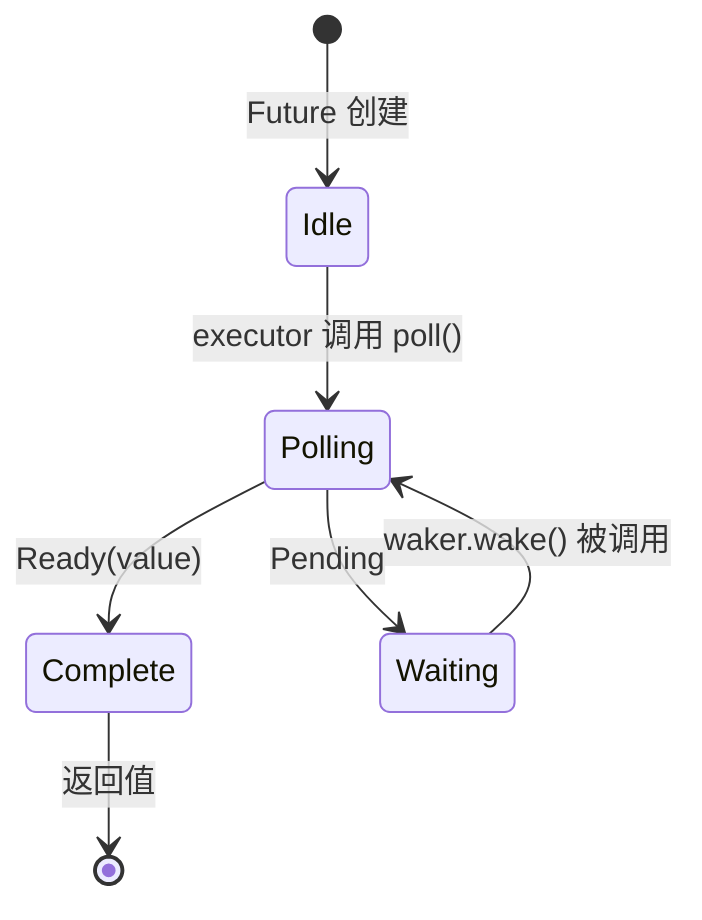

# 3. Poll 如何工作 🟡

> **你将学到：**
> - 执行器的轮询循环：poll → pending → wake → poll again
> - 如何从零开始构建一个最小执行器
> - 虚假唤醒规则及其重要性
> - 实用工具函数：`poll_fn()` 和 `yield_now()`

## 轮询状态机

执行器运行一个循环：轮询一个 future，如果它是 `Pending`，则将其停放直到其 waker 触发，然后再次轮询。这与 OS 线程有根本区别，内核处理调度。



> **重要**：当处于 *Waiting* 状态时，future **必须**已向 I/O 源注册 waker。不注册 = 永远挂起。

### 一个最小执行器

为了揭开执行器的神秘面屑，让我们构建一个最简单的执行器：

```rust
use std::future::Future;
use std::task::{Context, Poll, RawWaker, RawWakerVTable, Waker};
use std::pin::Pin;

/// 最简单的执行器：忙轮询直到 Ready
fn block_on<F: Future>(mut future: F) -> F::Output {
    // 将 future 固定在栈上
    // SAFETY: `future` 在此之后从不移动——我们只通过
    // 固定引用访问它直到它完成。
    let mut future = unsafe { Pin::new_unchecked(&mut future) };

    // 创建一个无操作 waker（只是保持轮询——低效但简单）
    fn noop_raw_waker() -> RawWaker {
        fn no_op(_: *const ()) {}
        fn clone(_: *const ()) -> RawWaker { noop_raw_waker() }
        let vtable = &RawWakerVTable::new(clone, no_op, no_op, no_op);
        RawWaker::new(std::ptr::null(), vtable)
    }

    let waker = unsafe { Waker::from_raw(noop_raw_waker()) };
    let mut cx = Context::from_waker(&waker);

    // 忙循环直到 future 完成
    loop {
        match future.as_mut().poll(&mut cx) {
            Poll::Ready(value) => return value,
            Poll::Pending => {
                // 真正的执行器会在这里停放线程
                // 并等待 waker.wake()——我们只是自旋
                std::thread::yield_now();
            }
        }
    }
}

// 用法：
fn main() {
    let result = block_on(async {
        println!("Hello from our mini executor!");
        42
    });
    println!("Got: {result}");
}
```

> **不要在生产环境中使用这个！** 它忙轮询，浪费 CPU。真正的执行器
> (tokio, smol) 使用 `epoll`/`kqueue`/`io_uring` 来睡眠直到 I/O 就绪。
> 但这展示了核心思想：执行器只是一个调用 `poll()` 的循环。

### 唤醒通知

真正的执行器是事件驱动的。当所有 futures 都是 `Pending` 时，执行器睡眠。waker 是一个中断机制：

```rust
// 真正执行器主循环的概念模型：
fn executor_loop(tasks: &mut TaskQueue) {
    loop {
        // 1. 轮询所有已被唤醒的任务
        while let Some(task) = tasks.get_woken_task() {
            match task.poll() {
                Poll::Ready(result) => task.complete(result),
                Poll::Pending => { /* 任务留在队列中，等待唤醒 */ }
            }
        }

        // 2. 睡眠直到有东西唤醒我们 (epoll_wait, kevent, 等.)
        //    这就是 mio/polling 做重活的地方
        tasks.wait_for_events(); // 阻塞直到有 I/O 事件或 waker 触发
    }
}
```

### 虚假唤醒

一个 future 可能在 I/O 未就绪时也被轮询。这叫做*虚假唤醒*。Futures 必须正确处理这种情况：

```rust
impl Future for MyFuture {
    type Output = Data;

    fn poll(self: Pin<&mut Self>, cx: &mut Context<'_>) -> Poll<Data> {
        // ✅ 正确：总是重新检查实际条件
        if let Some(data) = self.try_read_data() {
            Poll::Ready(data)
        } else {
            // 重新注册 waker（它可能已改变！）
            self.register_waker(cx.waker());
            Poll::Pending
        }

        // ❌ 错误：假设 poll 意味着数据已就绪
        // let data = self.read_data(); // 可能阻塞或 panic
        // Poll::Ready(data)
    }
}
```

**实现 `poll()` 的规则**：
1. **永远不阻塞** — 如果未就绪，立即返回 `Pending`
2. **总是重新注册 waker** — 它可能在轮询之间已改变
3. **处理虚假唤醒** — 检查实际条件，不要假设就绪状态
4. **不要在 `Ready` 之后轮询** — 行为是**未指定的**（可能 panic、返回 `Pending` 或重复 `Ready`）。只有 `FusedFuture` 保证安全的后续轮询

<details>
<summary><strong>🏋️ 练习：实现 CountdownFuture</strong>（点击展开）</summary>

**挑战**：实现一个 `CountdownFuture`，从 N倒数到 0，*每次被轮询时打印*当前计数作为副作用。当到达 0 时，以 `Ready("Liftoff!")` 完成。（注意：`Future` 只产生**一个**最终值——打印是副作用，不是产生的值。要产生多个异步值，参见第 11 章的 `Stream`。）

*提示*：这不需要真实的 I/O 源——它可以在每次递减后立即用 `cx.waker().wake_by_ref()` 唤醒自己。

<details>
<summary>🔑 答案</summary>

```rust
use std::future::Future;
use std::pin::Pin;
use std::task::{Context, Poll};

struct CountdownFuture {
    count: u32,
}

impl CountdownFuture {
    fn new(start: u32) -> Self {
        CountdownFuture { count: start }
    }
}

impl Future for CountdownFuture {
    type Output = &'static str;

    fn poll(mut self: Pin<&mut Self>, cx: &mut Context<'_>) -> Poll<Self::Output> {
        if self.count == 0 {
            Poll::Ready("Liftoff!")
        } else {
            println!("{}...", self.count);
            self.count -= 1;
            // 立即唤醒——我们总是准备好取得进展
            cx.waker().wake_by_ref();
            Poll::Pending
        }
    }
}

// 与我们的最小执行器或 tokio 一起使用：
// let msg = block_on(CountdownFuture::new(5));
// 输出：5... 4... 3... 2... 1...
// msg == "Liftoff!"
```

**关键要点**：尽管这个 future 总是准备好取得进展，它返回 `Pending` 来在各步骤之间放弃控制权。它立即调用 `wake_by_ref()` 以便执行器立即重新轮询它。这是协作式多任务的基础——每个 future 自愿放弃。

</details>
</details>

### 实用工具：`poll_fn` 和 `yield_now`

标准库和 tokio 提供的两个工具，避免编写完整的 `Future` 实现：

```rust
use std::future::poll_fn;
use std::task::Poll;

// poll_fn：从闭包创建一个一次性 future
let value = poll_fn(|cx| {
    // 使用 cx.waker() 做些事情，返回 Ready 或 Pending
    Poll::Ready(42)
}).await;

// 真实世界用法：将基于回调的 API 桥接到 async
async fn read_when_ready(source: &MySource) -> Data {
    poll_fn(|cx| source.poll_read(cx)).await
}
```

```rust
// yield_now：自愿向执行器放弃控制权
// 在 CPU 重度的异步循环中使用，避免饿死其他任务
async fn cpu_heavy_work(items: &[Item]) {
    for (i, item) in items.iter().enumerate() {
        process(item); // CPU 工作

        // 每 100 个项目，放弃以允许其他任务运行
        if i % 100 == 0 {
            tokio::task::yield_now().await;
        }
    }
}
```

> **何时使用 `yield_now()`**：如果你的异步函数在循环中做 CPU 工作而没有任何 `.await` 点，
> 它会垄断执行器线程。定期插入 `yield_now().await` 以启用协作式多任务。

> **核心要点 — Poll 如何工作**
> - 执行器重复调用已被唤醒的 futures 的 `poll()`
> - Futures 必须处理**虚假唤醒**——总是重新检查实际条件
> - `poll_fn()` 让你从闭包创建临时 futures
> - `yield_now()` 是 CPU 重度异步代码的协作式调度逃生口

> **另见：** [第 2 章 — Future Trait](ch02-the-future-trait.md) 了解 trait 定义，[第 5 章 — 状态机揭秘](ch05-the-state-machine-reveal.md) 了解编译器生成的内容

***
