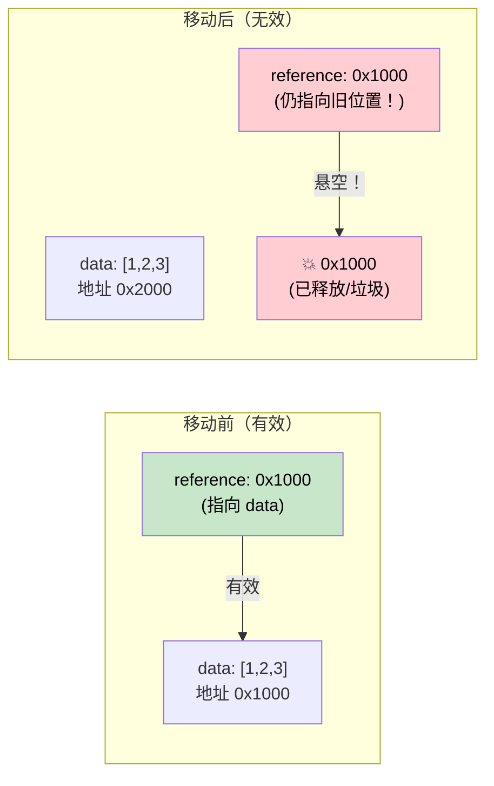

# 4. Pin 和 Unpin 🔴

> **你将学到：**
> - 为什么自引用结构体在内存中移动时会出问题
> - `Pin<P>` 保证什么以及它如何防止移动
> - 三个实用的 pinning 模式：`Box::pin()`、`tokio::pin!()`、`Pin::new()`
> - 何时 `Unpin` 提供逃生口

## 为什么需要 Pin

这是异步 Rust 中最令人困惑的概念。让我们一步步建立直觉。

### 问题：自引用结构体

当编译器将 `async fn` 转换为状态机时，该状态机可能包含对其自身字段的引用。这创建了一个*自引用结构体*——在内存中移动它会使这些内部引用失效。

```rust
// 编译器为以下代码生成的内容（简化版）：
// async fn example() {
//     let data = vec![1, 2, 3];
//     let reference = &data;       // 指向上面的 data
//     use_ref(reference).await;
// }

// 变成类似：
enum ExampleStateMachine {
    State0 {
        data: Vec<i32>,
        // reference: &Vec<i32>,  // 问题：指向上面的 `data`
        //                        // 如果这个结构体移动，指针就悬空了！
    },
    State1 {
        data: Vec<i32>,
        reference: *const Vec<i32>, // 指向 data 字段的内部指针
    },
    Complete,
}
```



### 自引用结构体

这不是学术担忧。每个在 `.await` 点之间持有引用的 `async fn` 都会创建一个自引用状态机：

```rust
async fn problematic() {
    let data = String::from("hello");
    let slice = &data[..]; // slice 借用了 data

    some_io().await; // <-- .await 点：状态机同时存储 data 和 slice

    println!("{slice}"); // 在 await 后使用引用
}
// 生成的状态机有 `data: String` 和 `slice: &str`
// 其中 slice 指向 data 内部。移动状态机 = 悬空指针。
```

### Pin 在实践中的应用

`Pin<P>` 是一个包装器，防止移动指针背后的值：

```rust
use std::pin::Pin;

let mut data = String::from("hello");

// Pin 它——现在它不能被移动了
let pinned: Pin<&mut String> = Pin::new(&mut data);

// 仍然可以使用它：
println!("{}", pinned.as_ref().get_ref()); // "hello"

// 但我们拿不回 &mut String（这将允许 mem::swap）：
// let mutable: &mut String = Pin::into_inner(pinned); // 只有当 String: Unpin 时
// String 是 Unpin，所以这实际上对 String 有效。
// 但对于自引用状态机（是 !Unpin），这是被阻止的。
```

在实际代码中，你主要在三个地方遇到 Pin：

```rust
// 1. poll() 签名——所有 futures 都通过 Pin 被轮询
fn poll(self: Pin<&mut Self>, cx: &mut Context<'_>) -> Poll<Output>;

// 2. Box::pin() — 堆分配并 pin 一个 future
let future: Pin<Box<dyn Future<Output = i32>>> = Box::pin(async { 42 });

// 3. tokio::pin!() — 在栈上 pin 一个 future
tokio::pin!(my_future);
// 现在 my_future: Pin<&mut impl Future>
```

### Unpin 逃生口

Rust 中大多数类型都是 `Unpin`——它们不包含自引用，所以 pin 是无操作。只有编译器生成的状态机（来自 `async fn`）是 `!Unpin`。

```rust
// 这些都是 Unpin — pinning 它们没有特殊作用：
// i32, String, Vec<T>, HashMap<K,V>, Box<T>, &T, &mut T

// 这些是 !Unpin — 它们必须在轮询前被 pin：
// async fn 和 async {} 生成的状态机

// 实际含义：
// 如果你手写一个 Future 且没有自引用，
// 实现 Unpin 使其更易于使用：
impl Unpin for MySimpleFuture {} // "我可以安全移动，相信我"
```

### 快速参考

| 什么 | 何时 | 如何 |
|------|------|-----|
| 在堆上 pin future | 存储在集合中、从函数返回 | `Box::pin(future)` |
| 在栈上 pin future | 在 `select!` 或手动轮询中本地使用 | `tokio::pin!(future)` 或 `pin-utils` 的 `pin_mut!` |
| 在函数签名中 pin | 接受被 pin 的 futures | `future: Pin<&mut F>` |
| 要求 Unpin | 当你需要在线程创建后移动 future 时 | `F: Future + Unpin` |

<details>
<summary><strong>🏋️ 练习：Pin 和 Move</strong>（点击展开）</summary>

**挑战**：以下代码片段哪些能编译？对于每个不能编译的，解释原因并修复。

```rust
// 片段 A
let fut = async { 42 };
let pinned = Box::pin(fut);
let moved = pinned; // 移动 Box
let result = moved.await;

// 片段 B
let fut = async { 42 };
tokio::pin!(fut);
let moved = fut; // 移动被 pin 的 future
let result = moved.await;

// 片段 C
use std::pin::Pin;
let mut fut = async { 42 };
let pinned = Pin::new(&mut fut);
```

<details>
<summary>🔑 答案</summary>

**片段 A**：✅ **能编译。** `Box::pin()` 将 future 放在堆上。移动 `Box` 移动的是*指针*，而不是 future 本身。Future 保持在堆上被 pin 的位置。

**片段 B**：❌ **不能编译。** `tokio::pin!` 将 future pin 在栈上并将 `fut` 重新绑定为 `Pin<&mut ...>`。你不能从 pinned 引用中移出。**修复**：不要移动它——在原地使用它：
```rust
let fut = async { 42 };
tokio::pin!(fut);
let result = fut.await; // 直接使用，不要重新赋值
```

**片段 C**：❌ **不能编译。** `Pin::new()` 要求 `T: Unpin`。Async 块生成 `!Unpin` 类型。**修复**：使用 `Box::pin()` 或 `unsafe Pin::new_unchecked()`：
```rust
let fut = async { 42 };
let pinned = Box::pin(fut); // 堆 pin — 对 !Unpin 有效
```

**关键要点**：`Box::pin()` 是 pin `!Unpin` futures 的安全、简单方式。`tokio::pin!()` 在栈上 pin，但之后不能移动 future。`Pin::new()` 只对 `Unpin` 类型有效。

</details>
</details>

> **核心要点 — Pin 和 Unpin**
> - `Pin<P>` 是一个包装器，**防止被指向的值被移动**——对自引用状态机至关重要
> - `Box::pin()` 是在堆上 pin futures 的安全、简单默认方式
> - `tokio::pin!()` 在栈上 pin——更便宜，但之后不能移动 future
> - `Unpin` 是一个自动 trait opt-out：实现 `Unpin` 的类型即使被 pin 时也可以移动（大多数类型是 `Unpin`；async 块不是）

> **另见：** [第 2 章 — Future Trait](ch02-the-future-trait.md) 了解 poll 中的 `Pin<&mut Self>`，[第 5 章 — 状态机揭秘](ch05-the-state-machine-reveal.md) 了解为什么 async 状态机是自引用的

***
