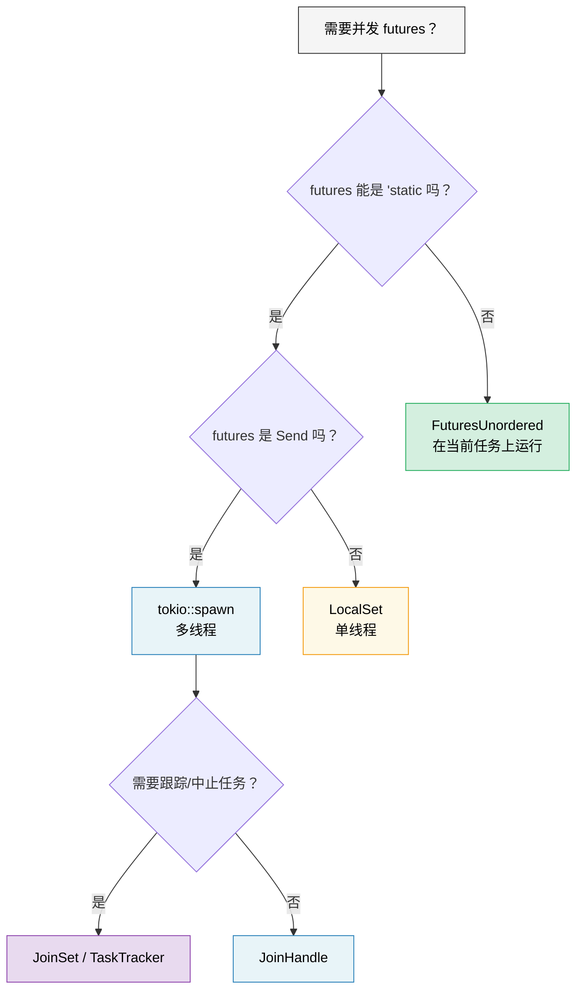

# 9. 何时 Tokio 不是最佳选择 🟡

> **你将学到：**
> - `'static` 问题：何时 `tokio::spawn` 迫使你到处使用 `Arc`
> - 用于 `!Send` futures 的 `LocalSet`
> - 用于借用友好的并发的 `FuturesUnordered`（不需要 spawn）
> - 用于托管任务组的 `JoinSet`
> - 编写运行时无关的库



## 'static Future 问题

Tokio 的 `spawn` 要求 `'static` futures。这意味着你不能在生成的任务中借用本地数据：

```rust
async fn process_items(items: &[String]) {
    // ❌ 不能这样做 — items 是借用的，不是 'static
    // for item in items {
    //     tokio::spawn(async {
    //         process(item).await;
    //     });
    // }

    // 😐 变通方案 1：克隆所有东西
    for item in items {
        let item = item.clone();
        tokio::spawn(async move {
            process(&item).await;
        });
    }

    // 😐 变通方案 2：使用 Arc
    let items = Arc::new(items.to_vec());
    for i in 0..items.len() {
        let items = Arc::clone(&items);
        tokio::spawn(async move {
            process(&items[i]).await;
        });
    }
}
```

这很烦人！在 Go 中，你可以直接 `go func() { use(item) }` 用闭包。在 Rust 中，所有权系统迫使你思考谁拥有什么以及它能活多久。

### 作用域任务和替代方案

针对 `'static` 问题存在几个解决方案：

```rust
// 1. tokio::task::LocalSet — 在当前线程上运行 !Send futures
use tokio::task::LocalSet;

let local_set = LocalSet::new();
local_set.run_until(async {
    tokio::task::spawn_local(async {
        // 这里可以使用 Rc、Cell 和其他 !Send 类型
        let rc = std::rc::Rc::new(42);
        println!("{rc}");
    }).await.unwrap();
}).await;

// 2. FuturesUnordered — 并发而不生成任务
use futures::stream::{FuturesUnordered, StreamExt};

async fn process_items(items: &[String]) {
    let futures: FuturesUnordered<_> = items
        .iter()
        .map(|item| async move {
            // ✅ 可以借用 item — 不需要 spawn，不需要 'static！
            process(item).await
        })
        .collect();

    // 驱动所有 futures 到完成
    futures.for_each(|result| async {
        println!("Result: {result:?}");
    }).await;
}

// 3. tokio JoinSet (tokio 1.21+) — 托管的生成任务集合
use tokio::task::JoinSet;

async fn with_joinset() {
    let mut set = JoinSet::new();

    for i in 0..10 {
        set.spawn(async move {
            tokio::time::sleep(Duration::from_millis(100)).await;
            i * 2
        });
    }

    while let Some(result) = set.join_next().await {
        println!("Task completed: {:?}", result.unwrap());
    }
}
```

### 库的轻量级运行时

如果你在写一个库——不要强迫用户使用 tokio：

```rust
// ❌ 不好：库强迫用户使用 tokio
pub async fn my_lib_function() {
    tokio::time::sleep(Duration::from_secs(1)).await;
    // 现在你的用户必须使用 tokio
}

// ✅ 好：库是运行时无关的
pub async fn my_lib_function() {
    // 只使用 std::future 和 futures crate 的类型
    do_computation().await;
}

// ✅ 好：为 I/O 操作接受通用 future
pub async fn fetch_with_retry<F, Fut, T, E>(
    operation: F,
    max_retries: usize,
) -> Result<T, E>
where
    F: Fn() -> Fut,
    Fut: Future<Output = Result<T, E>>,
{
    for attempt in 0..max_retries {
        match operation().await {
            Ok(val) => return Ok(val),
            Err(e) if attempt == max_retries - 1 => return Err(e),
            Err(_) => continue,
        }
    }
    unreachable!()
}
```

> **经验法则**：库应该依赖 `futures` crate，而不是 `tokio`。
> 应用程序应该依赖 `tokio`（或他们选择的运行时）。
> 这保持生态系统的可组合性。

<details>
<summary><strong>🏋️ 练习：FuturesUnordered vs Spawn</strong>（点击展开）</summary>

**挑战**：用两种方式编写相同的函数——一次使用 `tokio::spawn`（要求 `'static`），一次使用 `FuturesUnordered`（借用数据）。函数接收 `&[String]` 并在模拟的异步查找后返回每个字符串的长度。

比较：哪种方法需要 `.clone()`？哪种可以借用输入切片？

<details>
<summary>🔑 答案</summary>

```rust
use futures::stream::{FuturesUnordered, StreamExt};
use tokio::time::{sleep, Duration};

// 版本 1：tokio::spawn — 需要 'static，必须克隆
async fn lengths_with_spawn(items: &[String]) -> Vec<usize> {
    let mut handles = Vec::new();
    for item in items {
        let owned = item.clone(); // 必须克隆 — spawn 要求 'static
        handles.push(tokio::spawn(async move {
            sleep(Duration::from_millis(10)).await;
            owned.len()
        }));
    }

    let mut results = Vec::new();
    for handle in handles {
        results.push(handle.await.unwrap());
    }
    results
}

// 版本 2：FuturesUnordered — 借用数据，不需要克隆
async fn lengths_without_spawn(items: &[String]) -> Vec<usize> {
    let futures: FuturesUnordered<_> = items
        .iter()
        .map(|item| async move {
            sleep(Duration::from_millis(10)).await;
            item.len() // ✅ 借用 item — 不需要克隆！
        })
        .collect();

    futures.collect().await
}

#[tokio::test]
async fn test_both_versions() {
    let items = vec!["hello".into(), "world".into(), "rust".into()];

    let v1 = lengths_with_spawn(&items).await;
    // 注意：v1 保持插入顺序（顺序 join）

    let mut v2 = lengths_without_spawn(&items).await;
    v2.sort(); // FuturesUnordered 按完成顺序返回

    assert_eq!(v1, vec![5, 5, 4]);
    assert_eq!(v2, vec![4, 5, 5]);
}
```

**关键要点**：`FuturesUnordered` 通过在当前任务上运行所有 futures 来避免 `'static` 要求（没有线程迁移）。权衡：所有 futures 共享一个任务——如果一个阻塞，其他也会停滞。使用 `spawn` 来处理应该在单独线程上运行的 CPU 重度工作。

</details>
</details>

> **核心要点 — 何时 Tokio 不是最佳选择**
> - `FuturesUnordered` 在当前任务上并发运行 futures — 不需要 `'static` 要求
> - `LocalSet` 在单线程执行器上启用 `!Send` futures
> - `JoinSet`（tokio 1.21+）提供带自动清理的托管任务组
> - 对于库：只依赖 `std::future::Future` + `futures` crate，而不是直接依赖 tokio

> **另见：** [第 8 章 — Tokio 深度探讨](ch08-tokio-deep-dive.md) 了解何时 spawn 是正确的工具，[第 11 章 — Streams](ch11-streams-and-asynciterator.md) 了解 `buffer_unordered()` 作为另一种并发限制器

***
