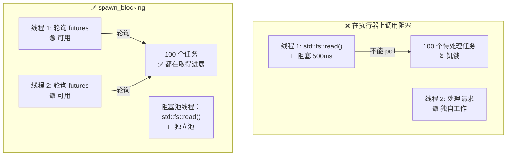

# 12. 常见陷阱 🔴

> **你将学到：**
> - 9 个常见的异步 Rust bug 以及如何修复每一个
> - 为什么阻塞执行器是 #1 错误（以及 `spawn_blocking` 如何修复它）
> - 取消危害：当一个 future 在 mid-await 被 drop 时会发生什么
> - 调试：`tokio-console`、`tracing`、`#[instrument]`
> - 测试：`#[tokio::test]`、`time::pause()`、基于 trait 的模拟

## 阻塞执行器

异步 Rust 中的第一大错误：在异步执行器线程上运行阻塞代码。这会饿死其他任务。

```rust
// ❌ 错误：在整个执行器线程上阻塞
async fn bad_handler() -> String {
    let data = std::fs::read_to_string("big_file.txt").unwrap(); // 阻塞！
    process(&data)
}

// ✅ 正确：将阻塞工作卸载到专用线程池
async fn good_handler() -> String {
    let data = tokio::task::spawn_blocking(|| {
        std::fs::read_to_string("big_file.txt").unwrap()
    }).await.unwrap();
    process(&data)
}

// ✅ 也是正确：使用 tokio 的异步 fs
async fn also_good_handler() -> String {
    let data = tokio::fs::read_to_string("big_file.txt").await.unwrap();
    process(&data)
}
```



### std::thread::sleep vs tokio::time::sleep

```rust
// ❌ 错误：阻塞执行器线程 5 秒
async fn bad_delay() {
    std::thread::sleep(Duration::from_secs(5)); // 线程不能轮询其他任何东西！
}

// ✅ 正确：向执行器让出，其他任务可以运行
async fn good_delay() {
    tokio::time::sleep(Duration::from_secs(5)).await; // 非阻塞！
}
```

### 在 .await 跨越持有 MutexGuard

```rust
use std::sync::Mutex; // std Mutex — 不是异步感知的

// ❌ 错误：MutexGuard 跨越 .await 持有
async fn bad_mutex(data: &Mutex<Vec<String>>) {
    let mut guard = data.lock().unwrap();
    guard.push("item".into());
    some_io().await; // 💥 Guard 在这里被持有——阻止其他线程获取锁！
    guard.push("another".into());
}
// 同样：std::sync::MutexGuard 是 !Send，所以在 tokio 的多线程运行时中这不能编译。

// ✅ 修复 1：将 guard 作用域化，在 .await 之前 drop
async fn good_mutex_scoped(data: &Mutex<Vec<String>>) {
    {
        let mut guard = data.lock().unwrap();
        guard.push("item".into());
    } // Guard 在这里 drop
    some_io().await; // 安全——锁已释放
    {
        let mut guard = data.lock().unwrap();
        guard.push("another".into());
    }
}

// ✅ 修复 2：使用 tokio::sync::Mutex（异步感知）
use tokio::sync::Mutex as AsyncMutex;

async fn good_async_mutex(data: &AsyncMutex<Vec<String>>) {
    let mut guard = data.lock().await; // 异步锁——不阻塞线程
    guard.push("item".into());
    some_io().await; // 可以——tokio Mutex guard 是 Send
    guard.push("another".into());
}
```

> **何时使用哪种 Mutex**：
> - `std::sync::Mutex`：没有内部 `.await` 的短临界区
> - `tokio::sync::Mutex`：当您必须在 `.await` 点之间持有锁时
> - `parking_lot::Mutex`：直接替代 `std`，更快，更小，仍然不能在 `.await` 中使用

### 取消危害

Drop 一个 future 会取消它——但这可能使事情处于不一致状态：

```rust
// ❌ 危险：取消时资源泄漏
async fn transfer(from: &Account, to: &Account, amount: u64) {
    from.debit(amount).await;  // 如果在这里取消...
    to.credit(amount).await;   // ...钱消失了！
}

// ✅ 安全：使操作原子化或使用补偿
async fn safe_transfer(from: &Account, to: &Account, amount: u64) -> Result<(), Error> {
    // 使用数据库事务（全有或全无）
    let tx = db.begin_transaction().await?;
    tx.debit(from, amount).await?;
    tx.credit(to, amount).await?;
    tx.commit().await?; // 只有在一切成功时才提交
    Ok(())
}

// ✅ 也是安全：使用 tokio::select! 并具有取消意识
tokio::select! {
    result = transfer(from, to, amount) => {
        // 转移完成
    }
    _ = shutdown_signal() => {
        // 不要在转移中途取消——让它完成
        // 或者：显式回滚
    }
}
```

### 没有 Async Drop

Rust 的 `Drop` trait 是同步的——你**不能**在 `drop()` 中 `.await`。这是经常混淆的来源：

```rust
struct DbConnection { /* ... */ }

impl Drop for DbConnection {
    fn drop(&mut self) {
        // ❌ 不能这样做——drop() 是同步的！
        // self.connection.shutdown().await;

        // ✅ 变通方案 1：产生一个清理任务（fire-and-forget）
        let conn = self.connection.take();
        tokio::spawn(async move {
            let _ = conn.shutdown().await;
        });

        // ✅ 变通方案 2：使用同步关闭
        // self.connection.blocking_close();
    }
}
```

**最佳实践**：提供一个显式的 `async fn close(self)` 方法并记录调用者应该使用它。只将 `Drop` 作为安全网而不是主要清理路径。

### select! 公平性和饥饿

```rust
use tokio::sync::mpsc;

// ❌ 不公平：busy_stream 总是赢，slow_stream 饥饿
async fn unfair(mut fast: mpsc::Receiver<i32>, mut slow: mpsc::Receiver<i32>) {
    loop {
        tokio::select! {
            Some(v) = fast.recv() => println!("fast: {v}"),
            Some(v) = slow.recv() => println!("slow: {v}"),
            // 如果两者都就绪，tokio 随机选择一个。
            // 但如果 `fast` 总是就绪，`slow` 很少被轮询。
        }
    }
}

// ✅ 公平：使用有偏 select 或批量排空
async fn fair(mut fast: mpsc::Receiver<i32>, mut slow: mpsc::Receiver<i32>) {
    loop {
        tokio::select! {
            biased; // 总是按顺序检查——显式优先级

            Some(v) = slow.recv() => println!("slow: {v}"),  // 优先级！
            Some(v) = fast.recv() => println!("fast: {v}"),
        }
    }
}
```

### 意外的顺序执行

```rust
// ❌ 顺序：总共需要 2 秒
async fn slow() {
    let a = fetch("url_a").await; // 1 秒
    let b = fetch("url_b").await; // 1 秒（先等待 a 完成！）
}

// ✅ 并发：总共只需要 1 秒
async fn fast() {
    let (a, b) = tokio::join!(
        fetch("url_a"), // 两者立即开始
        fetch("url_b"),
    );
}

// ✅ 也是并发：使用 let + join
async fn also_fast() {
    let fut_a = fetch("url_a"); // 创建 future（惰性——尚未开始）
    let fut_b = fetch("url_b"); // 创建 future
    let (a, b) = tokio::join!(fut_a, fut_b); // 现在两者并发运行
}
```

> **陷阱**：`let a = fetch(url).await; let b = fetch(url).await;` 是顺序的！
> 第二个 `.await` 直到第一个完成后才开始。使用 `join!` 或 `spawn` 来实现并发。

## 案例研究：调试一个挂起的生产服务

一个真实场景：服务在 10 分钟内处理请求良好，然后停止响应。日志中没有错误。CPU 为 0%。

**诊断步骤：**

1. **附加 `tokio-console`** — 揭示 200+ 个任务处于 `Pending` 状态
2. **检查任务详情** — 所有任务都在等待同一个 `Mutex::lock().await`
3. **根本原因** — 一个任务在 `.await` 上持有 `std::sync::MutexGuard` 并 panic，使 mutex 中毒。所有其他任务现在都在 `lock().unwrap()` 上失败

**修复：**

| 之前（坏了） | 之后（修复了） |
|-----------------|---------------|
| `std::sync::Mutex` | `tokio::sync::Mutex` |
| 在 `.await` 上跨域 `.lock().unwrap()` | 在 `.await` 前将锁作用域化 |
| 获取锁时没有超时 | `tokio::time::timeout(dur, mutex.lock())` |
| 中毒 mutex 后没有恢复 | `tokio::sync::Mutex` 不会中毒 |

**预防清单：**
- [ ] 如果 guard 跨越任何 `.await`，使用 `tokio::sync::Mutex`
- [ ] 在异步函数上添加 `#[tracing::instrument]` 以进行跨度跟踪
- [ ] 在 staging 环境中运行 `tokio-console` 以尽早发现挂起的任务
- [ ] 添加健康检查端点来验证任务响应能力

<details>
<summary><strong>🏋️ 练习：发现 Bug</strong>（点击展开）</summary>

**挑战**：找出这段代码中的所有异步陷阱并修复它们。

```rust
use std::sync::Mutex;

async fn process_requests(urls: Vec<String>) -> Vec<String> {
    let results = Mutex::new(Vec::new());

    for url in &urls {
        let response = reqwest::get(url).await.unwrap().text().await.unwrap();
        std::thread::sleep(std::time::Duration::from_millis(100)); // 速率限制
        let mut guard = results.lock().unwrap();
        guard.push(response);
        expensive_parse(&guard).await; // 解析到目前为止的所有结果
    }

    results.into_inner().unwrap()
}
```

<details>
<summary>🔑 答案</summary>

**发现的 Bug：**

1. **顺序获取** — URL 是一个接一个获取的，而不是并发获取
2. **`std::thread::sleep`** — 阻塞执行器线程
3. **MutexGuard 跨越 `.await` 持有** — 当 `expensive_parse` 被 await 时 `guard` 仍然活着
4. **没有并发** — 应该使用 `join!` 或 `FuturesUnordered`

```rust
use tokio::sync::Mutex;
use std::sync::Arc;
use futures::stream::{self, StreamExt};

async fn process_requests(urls: Vec<String>) -> Vec<String> {
    // 修复 4：使用 buffer_unordered 并发处理 URL
    let results: Vec<String> = stream::iter(urls)
        .map(|url| async move {
            let response = reqwest::get(&url).await.unwrap().text().await.unwrap();
            // 修复 2：使用 tokio::time::sleep 而不是 std::thread::sleep
            tokio::time::sleep(std::time::Duration::from_millis(100)).await;
            response
        })
        .buffer_unordered(10) // 最多 10 个并发请求
        .collect()
        .await;

    // 修复 3：在收集之后解析——根本不需要 mutex！
    for result in &results {
        expensive_parse(result).await;
    }

    results
}
```

**关键要点**：你通常可以重构异步代码以完全消除 mutex。用 streams/join 收集结果，然后处理。更简单、更快、没有死锁风险。

</details>
</details>

---

### 调试异步代码

异步栈跟踪是出了名的隐晦——它们显示执行器的 poll 循环而不是你的逻辑调用链。以下是必要的调试工具。

#### tokio-console：实时任务检查器

[tokio-console](https://github.com/tokio-rs/console) 为你提供类似 `htop` 的视图，查看每个生成的任务：其状态、poll 持续时间、waker 活动和资源使用。

```toml
# Cargo.toml
[dependencies]
console-subscriber = "0.4"
tokio = { version = "1", features = ["full", "tracing"] }
```

```rust
#[tokio::main]
async fn main() {
    console_subscriber::init(); // 替换默认的 tracing subscriber
    // ... 应用程序的其余部分
}
```

然后在另一个终端：

```bash
$ RUSTFLAGS="--cfg tokio_unstable" cargo run   # 需要的编译时标志
$ tokio-console                                # 连接到 127.0.0.1:6669
```

#### tracing + #[instrument]：异步的结构化日志

[`tracing`](https://docs.rs/tracing) crate 理解 `Future` 生命周期。跨度在 `.await` 点之间保持打开，即使 OS 线程已继续，也能给你逻辑调用栈：

```rust
use tracing::{info, instrument};

#[instrument(skip(db_pool), fields(user_id = %user_id))]
async fn handle_request(user_id: u64, db_pool: &Pool) -> Result<Response> {
    info!("looking up user");
    let user = db_pool.get_user(user_id).await?;  // span 在 .await 跨越时保持打开
    info!(email = %user.email, "found user");
    let orders = fetch_orders(user_id).await?;     // 仍然是同一个 span
    Ok(build_response(user, orders))
}
```

输出（使用 `tracing_subscriber::fmt::json()`）：

```json
{"timestamp":"...","level":"INFO","span":{"name":"handle_request","user_id":"42"},"message":"looking up user"}
{"timestamp":"...","level":"INFO","span":{"name":"handle_request","user_id":"42"},"fields":{"email":"a@b.com"},"message":"found user"}
```

#### 调试清单

| 症状 | 可能原因 | 工具 |
|---------|-------------|------|
| 任务永远挂起 | 缺少 `.await` 或死锁的 `Mutex` | `tokio-console` 任务视图 |
| 低吞吐量 | 在异步线程上调用阻塞 | `tokio-console` poll-time 直方图 |
| `Future is not Send` | 在 `.await` 上持有非 Send 类型 | 编译器错误 + `#[instrument]` 定位 |
| 神秘的取消 | 父 `select!` drop 了一个分支 | `tracing` span 生命周期事件 |

> **提示**：启用 `RUSTFLAGS="--cfg tokio_unstable"` 以在 tokio-console 中获取任务级指标。这是一个编译时标志，不是运行时标志。

### 测试异步代码

异步代码引入了独特的测试挑战——你需要运行时、时间控制测试和测试并发行为的策略。

**使用 `#[tokio::test]` 的基本异步测试**：

```rust
// Cargo.toml
// [dev-dependencies]
// tokio = { version = "1", features = ["full", "test-util"] }

#[tokio::test]
async fn test_basic_async() {
    let result = fetch_data().await;
    assert_eq!(result, "expected");
}

// 单线程测试（对 !Send 类型有用）：
#[tokio::test(flavor = "current_thread")]
async fn test_single_threaded() {
    let rc = std::rc::Rc::new(42);
    let val = async { *rc }.await;
    assert_eq!(val, 42);
}

// 多线程，明确的工作线程数：
#[tokio::test(flavor = "multi_thread", worker_threads = 2)]
async fn test_concurrent_behavior() {
    // 用真实并发测试竞态条件
    let counter = std::sync::Arc::new(std::sync::atomic::AtomicU32::new(0));
    let c1 = counter.clone();
    let c2 = counter.clone();
    let (a, b) = tokio::join!(
        tokio::spawn(async move { c1.fetch_add(1, std::sync::atomic::Ordering::SeqCst) }),
        tokio::spawn(async move { c2.fetch_add(1, std::sync::atomic::Ordering::SeqCst) }),
    );
    a.unwrap();
    b.unwrap();
    assert_eq!(counter.load(std::sync::atomic::Ordering::SeqCst), 2);
}
```

**时间操作** — 测试超时而不实际等待：

```rust
use tokio::time::{self, Duration, Instant};

#[tokio::test]
async fn test_timeout_behavior() {
    // 暂停时间 — sleep() 立即推进，没有真实的挂钟延迟
    time::pause();

    let start = Instant::now();
    time::sleep(Duration::from_secs(3600)).await; // "等待" 1 小时 — 花费 0ms
    assert!(start.elapsed() >= Duration::from_secs(3600));
    // 测试在几毫秒内运行，而不是一小时！
}

#[tokio::test]
async fn test_retry_timing() {
    time::pause();

    // 测试我们的重试逻辑是否等待预期的持续时间
    let start = Instant::now();
    let result = retry_with_backoff(|| async {
        Err::<(), _>("simulated failure")
    }, 3, Duration::from_secs(1))
    .await;

    assert!(result.is_err());
    // 1s + 2s + 4s = 7s 退避（指数）
    assert!(start.elapsed() >= Duration::from_secs(7));
}

#[tokio::test]
async fn test_deadline_exceeded() {
    time::pause();

    let result = tokio::time::timeout(
        Duration::from_secs(5),
        async {
            // 模拟慢操作
            time::sleep(Duration::from_secs(10)).await;
            "done"
        }
    ).await;

    assert!(result.is_err()); // 超时
}
```

**模拟异步依赖** — 使用 trait 对象或泛型：

```rust
// 为依赖定义一个 trait：
trait Storage {
    async fn get(&self, key: &str) -> Option<String>;
    async fn set(&self, key: &str, value: String);
}

// 生产实现：
struct RedisStorage { /* ... */ }
impl Storage for RedisStorage {
    async fn get(&self, key: &str) -> Option<String> {
        // 真实的 Redis 调用
        todo!()
    }
    async fn set(&self, key: &str, value: String) {
        todo!()
    }
}

// 测试 mock：
struct MockStorage {
    data: std::sync::Mutex<std::collections::HashMap<String, String>>,
}

impl MockStorage {
    fn new() -> Self {
        MockStorage { data: std::sync::Mutex::new(std::collections::HashMap::new()) }
    }
}

impl Storage for MockStorage {
    async fn get(&self, key: &str) -> Option<String> {
        self.data.lock().unwrap().get(key).cloned()
    }
    async fn set(&self, key: &str, value: String) {
        self.data.lock().unwrap().insert(key.to_string(), value);
    }
}

// 被测试的函数是针对 Storage 的泛型：
async fn cache_lookup<S: Storage>(store: &S, key: &str) -> String {
    match store.get(key).await {
        Some(val) => val,
        None => {
            let val = "computed".to_string();
            store.set(key, val.clone()).await;
            val
        }
    }
}

#[tokio::test]
async fn test_cache_miss_then_hit() {
    let mock = MockStorage::new();

    // 第一次调用：未命中 → 计算并存储
    let val = cache_lookup(&mock, "key1").await;
    assert_eq!(val, "computed");

    // 第二次调用：命中 → 返回存储的值
    let val = cache_lookup(&mock, "key1").await;
    assert_eq!(val, "computed");
    assert!(mock.data.lock().unwrap().contains_key("key1"));
}
```

**测试通道和任务通信**：

```rust
#[tokio::test]
async fn test_producer_consumer() {
    let (tx, mut rx) = tokio::sync::mpsc::channel(10);

    tokio::spawn(async move {
        for i in 0..5 {
            tx.send(i).await.unwrap();
        }
        // tx 在这里 drop — 通道关闭
    });

    let mut received = Vec::new();
    while let Some(val) = rx.recv().await {
        received.push(val);
    }

    assert_eq!(received, vec![0, 1, 2, 3, 4]);
}
```

| 测试模式 | 何时使用 | 关键工具 |
|-------------|-------------|----------|
| `#[tokio::test]` | 所有异步测试 | `tokio = { features = ["macros", "rt"] }` |
| `time::pause()` | 测试超时、重试、定期任务 | `tokio::time::pause()` |
| Trait 模拟 | 测试业务逻辑而不需要 I/O | 泛型 `<S: Storage>` |
| `current_thread` 风格 | 测试 `!Send` 类型或确定性调度 | `#[tokio::test(flavor = "current_thread")]` |
| `multi_thread` 风格 | 测试竞态条件 | `#[tokio::test(flavor = "multi_thread")]` |

> **核心要点 — 常见陷阱**
> - 永远不要阻塞执行器——对 CPU/同步工作使用 `spawn_blocking`
> - 永远不要在 `.await` 上持有 `MutexGuard`——将锁严格作用域化或使用 `tokio::sync::Mutex`
> - 取消立即 drop future——对部分操作使用"取消安全"模式
> - 使用 `tokio-console` 和 `#[tracing::instrument]` 调试异步代码
> - 使用 `#[tokio::test]` 和 `time::pause()` 测试异步代码以获得确定性时序

> **另见：** [第 8 章 — Tokio 深度探讨](ch08-tokio-deep-dive.md) 了解同步原语，[第 13 章 — 生产模式](ch13-production-patterns.md) 了解优雅关闭和结构化并发

***
