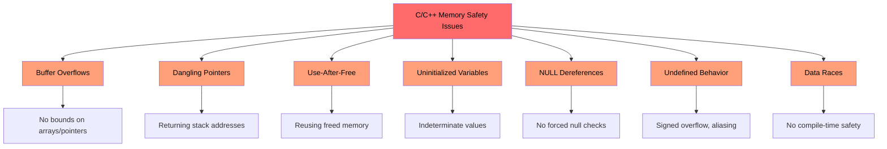
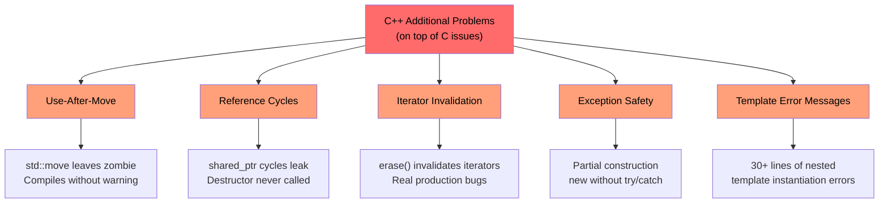
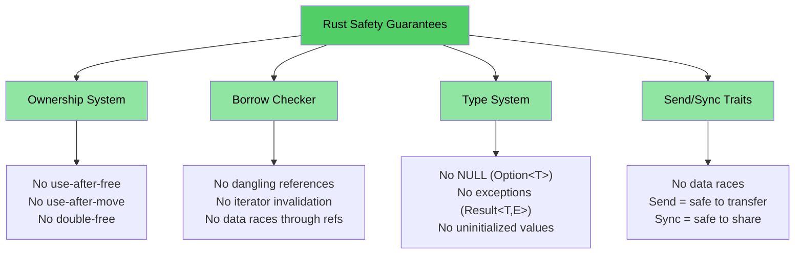

# 为什么 C/C++ 开发者需要 Rust

> **你将学到什么：**
> - Rust 消除的问题的完整列表——内存安全、未定义行为、数据竞争等
> - 为什么 `shared_ptr`、`unique_ptr` 和其他 C++ 缓解措施是权宜之计，而非解决方案
> - C 和 C++ 中具体漏洞示例，这些在安全 Rust 中结构上不可能存在

> **想直接看代码？** 跳转到[给我看些代码](ch02-getting-started.md#enough-talk-already-show-me-some-code)

## Rust 消除的问题 — 完整列表

在深入示例之前，这里是执行摘要。安全 Rust **从结构上阻止**此列表中的每个问题——不是通过纪律、工具或代码审查，而是通过类型系统和编译器：

| **消除的问题** | **C** | **C++** | **Rust 如何防止** |
|----------------------|:-----:|:-------:|--------------------------|
| 缓冲区溢出/下溢 | ✅ | ✅ | 所有数组、切片和字符串都携带边界；索引在运行时检查 |
| 内存泄漏（无需 GC） | ✅ | ✅ | `Drop` trait = 正确实现的 RAII；自动清理，无需五条规则 |
| 野指针 | ✅ | ✅ | Lifetime 系统在编译时证明引用比其引用对象存活更久 |
| 使用后释放 | ✅ | ✅ | 所有权系统使其成为编译错误 |
| 使用后移动 | — | ✅ | 移动是**破坏性的**——原始绑定不再存在 |
| 未初始化变量 | ✅ | ✅ | 所有变量使用前必须初始化；编译器强制执行 |
| 整数溢出/下溢 UB | ✅ | ✅ | 调试构建在溢出时 panic；发布构建环绕（两者都是定义行为） |
| NULL 指针解引用 / SEGV | ✅ | ✅ | 无空指针；`Option<T>` 强制显式处理 |
| 数据竞争 | ✅ | ✅ | `Send`/`Sync` traits + 借用检查器使数据竞争成为编译错误 |
| 不可控副作用 | ✅ | ✅ | 默认不可变；需要显式 `mut` 才能变异 |
| 无继承（更好的可维护性） | — | ✅ | Traits + 组合替代类层次结构；促进复用而不耦合 |
| 无异常；可预测的控制流 | — | ✅ | 错误是值（`Result<T, E>`）；不可能被忽略，无隐藏的 `throw` 路径 |
| 迭代器失效 | — | ✅ | 借用检查器禁止在迭代时修改集合 |
| 引用循环/泄漏的终结器 | — | ✅ | 所有权是树形的；`Rc` 循环是可选的，可用 `Weak` 捕获 |
| 不会忘记解锁互斥锁 | ✅ | ✅ | `Mutex<T>` 包装数据；锁守卫是访问数据的唯一方式 |
| 未定义行为（一般） | ✅ | ✅ | 安全 Rust 有**零**未定义行为；`unsafe` 块是显式的且可审查的 |

> **底线：** 这些不是通过编码标准强制执行的 aspirational 目标。它们是**编译时保证**。如果你的代码能编译，这些 bug 就不可能存在。

---

## C 和 C++ 共有的问题

> **想跳过示例？** 跳转到 [Rust 如何解决所有这些问题](#how-rust-addresses-all-of-this) 或直接到 [给我看些代码](ch02-getting-started.md#enough-talk-already-show-me-some-code)

两种语言都共享一组核心的内存安全问题，这是超过 70% 的 CVE（常见漏洞和暴露）的根本原因：

### 缓冲区溢出

C arrays, pointers, and strings have no intrinsic bounds. It is trivially easy to exceed them:

```c
#include <stdlib.h>
#include <string.h>

void buffer_dangers() {
    char buffer[10];
    strcpy(buffer, "This string is way too long!");  // Buffer overflow

    int arr[5] = {1, 2, 3, 4, 5};
    int *ptr = arr;           // Loses size information
    ptr[10] = 42;             // No bounds check — undefined behavior
}
```

在 C++ 中，`std::vector::operator[]` 仍然不执行边界检查。只有 `.at()` 才会——但谁来捕获异常呢？

### 野指针和使用后释放

```c
int *bar() {
    int i = 42;
    return &i;    // Returns address of stack variable — dangling!
}

void use_after_free() {
    char *p = (char *)malloc(20);
    free(p);
    *p = '\0';   // Use after free — undefined behavior
}
```

### 未初始化变量和未定义行为

C 和 C++ 都允许未初始化变量。结果值是不确定的，读取它们是未定义行为：

```c
int x;               // Uninitialized
if (x > 0) { ... }  // UB — x could be anything
```

整数溢出在 C 中对于无符号类型是**定义的**，但对于有符号类型是**未定义的**。在 C++ 中，有符号溢出也是未定义行为。两个编译器都能并确实会利用这一点进行"优化"，以令人惊讶的方式破坏程序。

### NULL 指针解引用

```c
int *ptr = NULL;
*ptr = 42;           // SEGV — but the compiler won't stop you
```

在 C++ 中，`std::optional<T>` 有帮助但很冗长，通常被 `.value()` 绕过，而它会抛出异常。

### 可视化：共有问题



---

## C++ 在此基础上添加了更多问题

> **C 读者**：如果你不使用 C++，可以[跳转到 Rust 如何解决这些问题](#how-rust-addresses-all-of-this)。
>
> **想直接看代码？** 跳转到[给我看些代码](ch02-getting-started.md#enough-talk-already-show-me-some-code)

C++ 引入了智能指针、RAII、移动语义和异常来解决 C 的问题。这些是**权宜之计，而非根治**——它们将故障模式从"运行时崩溃"转变为"运行时更微妙的 bug"：

### `unique_ptr` 和 `shared_ptr` — 权宜之计，而非解决方案

C++ 智能指针比原始的 `malloc`/`free` 有显著改进，但它们没有解决根本问题：

| C++ 缓解措施 | 它修复了什么 | 它**没有**修复什么 |
|----------------|---------------|------------------------|
| `std::unique_ptr` | 通过 RAII 防止泄漏 | **使用后移动**仍然可以编译；留下僵尸 nullptr |
| `std::shared_ptr` | 共享所有权 | **引用循环**静默泄漏；`weak_ptr` 纪律是手动的 |
| `std::optional` | 替换一些空使用 | `.value()` 空时**抛出**——隐藏的控制流 |
| `std::string_view` | 避免复制 | 如果源字符串被释放则**悬空**——无 lifetime 检查 |
| 移动语义 | 高效传输 | 被移动的对象处于**"有效但未指定状态"**——UB 等待发生 |
| RAII | 自动清理 | 需要**五条规则**才能正确；一个错误破坏一切 |

```cpp
// unique_ptr: use-after-move compiles cleanly
std::unique_ptr<int> ptr = std::make_unique<int>(42);
std::unique_ptr<int> ptr2 = std::move(ptr);
std::cout << *ptr;  // Compiles! Undefined behavior at runtime.
                     // In Rust, this is a compile error: "value used after move"
```

```cpp
// shared_ptr: reference cycles leak silently
struct Node {
    std::shared_ptr<Node> next;
    std::shared_ptr<Node> parent;  // Cycle! Destructor never called.
};
auto a = std::make_shared<Node>();
auto b = std::make_shared<Node>();
a->next = b;
b->parent = a;  // Memory leak — ref count never reaches 0
                 // In Rust, Rc<T> + Weak<T> makes cycles explicit and breakable
```

### 使用后移动 — 沉默的杀手

C++ `std::move` 不是移动——它是类型转换。原始对象保持"有效但未指定状态"。编译器让你继续使用它：

```cpp
auto vec = std::make_unique<std::vector<int>>({1, 2, 3});
auto vec2 = std::move(vec);
vec->size();  // Compiles! But dereferencing nullptr — crash at runtime
```

在 Rust 中，移动是**破坏性的**。原始绑定消失了：

```rust
let vec = vec![1, 2, 3];
let vec2 = vec;           // Move — vec is consumed
// vec.len();             // Compile error: value used after move
```

### 迭代器失效 — 来自生产 C++ 的真实 bug

These aren't contrived examples — they represent **real bug patterns** found in large C++ codebases:

```cpp
// BUG 1: erase without reassigning iterator (undefined behavior)
while (it != pending_faults.end()) {
    if (*it != nullptr && (*it)->GetId() == fault->GetId()) {
        pending_faults.erase(it);   // ← iterator invalidated!
        removed_count++;            //   next loop uses dangling iterator
    } else {
        ++it;
    }
}
// Fix: it = pending_faults.erase(it);
```

```cpp
// BUG 2: index-based erase skips elements
for (auto i = 0; i < entries.size(); i++) {
    if (config_status == ConfigDisable::Status::Disabled) {
        entries.erase(entries.begin() + i);  // ← shifts elements
    }                                         //   i++ skips the shifted one
}
```

```cpp
// BUG 3: one erase path correct, the other isn't
while (it != incomplete_ids.end()) {
    if (current_action == nullptr) {
        incomplete_ids.erase(it);  // ← BUG: iterator not reassigned
        continue;
    }
    it = incomplete_ids.erase(it); // ← Correct path
}
```

**这些编译时没有任何警告。** 在 Rust 中，借用检查器使所有三个都成为编译错误——你不能在迭代时修改集合，就是这样。

### 异常安全和 `dynamic_cast`/`new` 模式

Modern C++ codebases still lean heavily on patterns that have no compile-time safety:

```cpp
// Typical C++ factory pattern — every branch is a potential bug
DriverBase* driver = nullptr;
if (dynamic_cast<ModelA*>(device)) {
    driver = new DriverForModelA(framework);
} else if (dynamic_cast<ModelB*>(device)) {
    driver = new DriverForModelB(framework);
}
// What if driver is still nullptr? What if new throws? Who owns driver?
```

在一个典型的 10 万行 C++ 代码库中，你可能会发现数百个 `dynamic_cast` 调用（每个都是潜在的运行时失败）、数百个原始 `new` 调用（每个都是潜在的泄漏），以及数百个 `virtual`/`override` 方法（到处都有 vtable 开销）。

### 野引用和 lambda 捕获

```cpp
int& get_reference() {
    int x = 42;
    return x;  // Dangling reference — compiles, UB at runtime
}

auto make_closure() {
    int local = 42;
    return [&local]() { return local; };  // Dangling capture!
}
```

### 可视化：C++ 额外问题



---

## Rust 如何解决所有这些问题

上述每个问题——来自 C 和 C++——都被 Rust 的编译时保证所阻止：

| 问题 | Rust 的解决方案 |
|---------|-----------------|
| 缓冲区溢出 | 切片携带长度；索引有边界检查 |
| 野指针/使用后释放 | Lifetime 系统在编译时证明引用是有效的 |
| 使用后移动 | 移动是破坏性的——编译器拒绝让你触碰原始值 |
| 内存泄漏 | `Drop` trait = 无需五条规则的 RAII；自动、正确的清理 |
| 引用循环 | 所有权是树形的；`Rc` + `Weak` 使循环显式且可打破 |
| 迭代器失效 | 借用检查器禁止在借用时修改集合 |
| NULL 指针 | 无 null。`Option<T>` 强制通过模式匹配显式处理 |
| 数据竞争 | `Send`/`Sync` traits 使数据竞争成为编译错误 |
| 未初始化变量 | 所有变量必须初始化；编译器强制执行 |
| 整数 UB | 调试在溢出时 panic；发布版本环绕（两者都是定义行为） |
| 异常 | 无异常；`Result<T, E>` 在类型签名中可见，用 `?` 传播 |
| 继承复杂性 | Traits + 组合；无菱形继承问题，无 vtable 脆弱性 |
| 忘记解锁互斥锁 | `Mutex<T>` 包装数据；锁守卫是唯一访问路径 | |

```rust
fn rust_prevents_everything() {
    // ✅ No buffer overflow — bounds checked
    let arr = [1, 2, 3, 4, 5];
    // arr[10];  // panic at runtime, never UB

    // ✅ No use-after-move — compile error
    let data = vec![1, 2, 3];
    let moved = data;
    // data.len();  // error: value used after move

    // ✅ No dangling pointer — lifetime error
    // let r;
    // { let x = 5; r = &x; }  // error: x does not live long enough

    // ✅ No null — Option forces handling
    let maybe: Option<i32> = None;
    // maybe.unwrap();  // panic, but you'd use match or if let instead

    // ✅ No data race — compile error
    // let mut shared = vec![1, 2, 3];
    // std::thread::spawn(|| shared.push(4));  // error: closure may outlive
    // shared.push(5);                         //   borrowed value
}
```

### Rust 的安全模型 — 全貌



## 快速参考：C vs C++ vs Rust

| **概念** | **C** | **C++** | **Rust** | **关键差异** |
|-------------|-------|---------|----------|-------------------|
| 内存管理 | `malloc()/free()` | `unique_ptr`, `shared_ptr` | `Box<T>`, `Rc<T>`, `Arc<T>` | 自动管理，无循环引用，无僵尸 |
| 数组 | `int arr[10]` | `std::vector<T>`, `std::array<T>` | `Vec<T>`, `[T; N]` | 默认边界检查 |
| 字符串 | `char*` 加上 `\0` | `std::string`, `string_view` | `String`, `&str` | UTF-8 保证，lifetime 检查 |
| 引用 | `int*`（原始） | `T&`, `T&&`（移动） | `&T`, `&mut T` | Lifetime + 借用检查 |
| 多态性 | 函数指针 | 虚函数，继承 | Traits，trait 对象 | 组合优于继承 |
| 泛型 | 宏 / `void*` | 模板 | 泛型 + trait bounds | 清晰的错误信息 |
| 错误处理 | 返回码，`errno` | 异常，`std::optional` | `Result<T, E>`, `Option<T>` | 无隐藏控制流 |
| NULL 安全 | `ptr == NULL` | `nullptr`, `std::optional<T>` | `Option<T>` | 强制空检查 |
| 线程安全 | 手动（pthreads） | 手动（`std::mutex` 等） | 编译时 `Send`/`Sync` | 数据竞争不可能 |
| 构建系统 | Make, CMake | CMake, Make 等 | Cargo | 集成工具链 |
| 未定义行为 | 盛行 | 微妙（有符号溢出，别名） | 安全代码中为零 | 安全性保证 |

***
