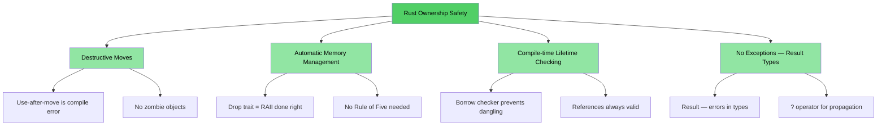
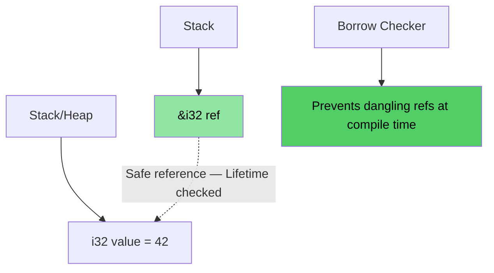
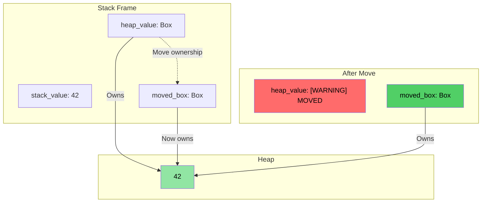
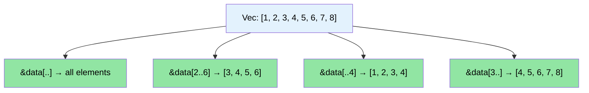

# 演讲者介绍与总体方法

> **你将学到什么：** 课程结构、交互格式，以及熟悉的 C/C++ 概念如何映射到 Rust 等价物。本章设定预期，并为你提供本书其余部分的路线图。

- 演讲者介绍
    - 微软 SCHIE（硅与云硬件基础设施工程）团队的首席固件架构师
    - 行业资深专家，精通安全、系统编程（固件、操作系统、虚拟机监控程序）、CPU 和平台架构以及 C++ 系统
    - 2017 年开始编程 Rust（@AWS EC2），从此爱上了这门语言
- 本课程尽可能以交互方式进行
    - 前提：你了解 C、C++ 或两者都了解
    - 示例经过精心设计，将熟悉的概念映射到 Rust 等价物
    - **请随时提出澄清问题**
- 演讲者期待与团队持续互动

# Rust 的优势
> **想直接看代码？** 跳转到[给我看些代码](ch02-getting-started.md#enough-talk-already-show-me-some-code)

无论你来自 C 还是 C++，核心痛点相同：内存安全漏洞能通过编译，但在运行时崩溃、损坏或泄漏。

- 超过 **70% 的 CVE** 是由内存安全问题引起的——缓冲区溢出、野指针、使用后释放
- C++ 的 `shared_ptr`、`unique_ptr`、RAII 和移动语义是正确方向的一步，但它们是**权宜之计，而非根治**——它们让使用后移动、引用循环、迭代器失效和异常安全性缺口大开
- Rust 提供了你依赖的 C/C++ 性能，但同时具有**编译时安全性保证**

> **📖 深度探讨：** 参见 [为什么 C/C++ 开发者需要 Rust](ch01-1-why-c-cpp-developers-need-rust.md)，了解具体漏洞示例、Rust 消除的完整列表，以及为什么 C++ 智能指针还不够

----

# Rust 如何解决这些问题？

## 缓冲区溢出和边界违规
- 所有 Rust 数组、切片和字符串都有明确的边界关联。编译器插入检查以确保任何边界违规都会导致**运行时崩溃**（Rust 术语称为 panic）——永远不会出现未定义行为

## 野指针和引用
- Rust 引入 lifetimes 和借用检查以在**编译时**消除野引用
- 没有野指针，没有使用后释放——编译器根本不会让你这么做

## 使用后移动
- Rust 的所有权系统使移动具有**破坏性**——一旦移动一个值，编译器**拒绝**让你使用原始值。没有僵尸对象，没有"有效但未指定的状态"

## 资源管理
- Rust 的 `Drop` trait 是正确实现的 RAII——编译器自动释放超出作用域的资源，并且**阻止使用后移动**，这是 C++ RAII 无法做到的
- 不需要五条规则（无需定义拷贝构造函数、移动构造函数、拷贝赋值运算符、移动赋值运算符、析构函数）

## 错误处理
- Rust 没有异常。所有错误都是值（`Result<T, E>`），使错误处理在类型签名中显式可见

## 迭代器失效
- Rust 的借用检查器**禁止在迭代集合时修改它**。你根本无法写出困扰 C++ 代码库的 bug：
```rust
// Rust equivalent of erase-during-iteration: retain()
pending_faults.retain(|f| f.id != fault_to_remove.id);

// Or: collect into a new Vec (functional style)
let remaining: Vec<_> = pending_faults
    .into_iter()
    .filter(|f| f.id != fault_to_remove.id)
    .collect();
```

## 数据竞争
- 类型系统通过 `Send` 和 `Sync` traits 在**编译时**防止数据竞争

## 内存安全性可视化

### Rust 所有权 — 设计即安全

```rust
fn safe_rust_ownership() {
    // Move is destructive: original is gone
    let data = vec![1, 2, 3];
    let data2 = data;           // Move happens
    // data.len();              // Compile error: value used after move
    
    // Borrowing: safe shared access
    let owned = String::from("Hello, World!");
    let slice: &str = &owned;  // Borrow — no allocation
    println!("{}", slice);     // Always safe
    
    // No dangling references possible
    /*
    let dangling_ref;
    {
        let temp = String::from("temporary");
        dangling_ref = &temp;  // Compile error: temp doesn't live long enough
    }
    */
}
```



## 内存布局：Rust 引用



### `Box<T>` 堆分配可视化

```rust
fn box_allocation_example() {
    // Stack allocation
    let stack_value = 42;
    
    // Heap allocation with Box
    let heap_value = Box::new(42);
    
    // Moving ownership
    let moved_box = heap_value;
    // heap_value is no longer accessible
}
```



## 切片操作可视化

```rust
fn slice_operations() {
    let data = vec![1, 2, 3, 4, 5, 6, 7, 8];
    
    let full_slice = &data[..];        // [1,2,3,4,5,6,7,8]
    let partial_slice = &data[2..6];   // [3,4,5,6]
    let from_start = &data[..4];       // [1,2,3,4]
    let to_end = &data[3..];           // [4,5,6,7,8]
}
```



# 其他 Rust 独特卖点与特性
- 线程间无数据竞争（编译时 `Send`/`Sync` 检查）
- 无使用后移动（与 C++ `std::move` 不同，它会留下僵尸对象）
- 无未初始化变量
    - 所有变量使用前必须初始化
- 无简单的内存泄漏
    - `Drop` trait = 正确实现的 RAII，无需五条规则
    - 编译器自动在变量超出作用域时释放内存
- 不会忘记解锁互斥锁
    - 锁守卫是访问数据的*唯一*方式（`Mutex<T>` 包装的是数据，而非访问）
- 无异常处理复杂性
    - 错误是值（`Result<T, E>`），在函数签名中可见，用 `?` 传播
- 出色的类型推断、枚举、模式匹配、零成本抽象支持
- 内置依赖管理、构建、测试、格式化、代码检查支持
    - `cargo` 替代了 make/CMake + lint + 测试框架

# 快速参考：Rust vs C/C++

| **概念** | **C** | **C++** | **Rust** | **关键差异** |
|-------------|-------|---------|----------|-------------------|
| 内存管理 | `malloc()/free()` | `unique_ptr`, `shared_ptr` | `Box<T>`, `Rc<T>`, `Arc<T>` | 自动管理，无循环引用 |
| 数组 | `int arr[10]` | `std::vector<T>`, `std::array<T>` | `Vec<T>`, `[T; N]` | 默认边界检查 |
| 字符串 | `char*` 加上 `\0` | `std::string`, `string_view` | `String`, `&str` | UTF-8 保证，lifetime 检查 |
| 引用 | `int* ptr` | `T&`, `T&&` (移动) | `&T`, `&mut T` | 借用检查，lifetimes |
| 多态性 | 函数指针 | 虚函数，继承 | Traits，trait 对象 | 组合优于继承 |
| 泛型编程 | 宏 (`void*`) | 模板 | 泛型 + trait bounds | 更好的错误信息 |
| 错误处理 | 返回码，`errno` | 异常，`std::optional` | `Result<T, E>`, `Option<T>` | 无隐藏控制流 |
| NULL/空安全 | `ptr == NULL` | `nullptr`, `std::optional<T>` | `Option<T>` | 强制空检查 |
| 线程安全 | 手动（pthreads） | 手动同步 | 编译时保证 | 数据竞争不可能 |
| 构建系统 | Make, CMake | CMake, Make 等 | Cargo | 集成工具链 |
| 未定义行为 | 运行时崩溃 | 微妙 UB（符号溢出，别名） | 编译时错误 | 安全性保证 |
