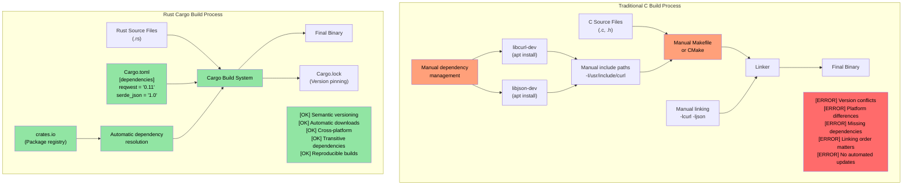
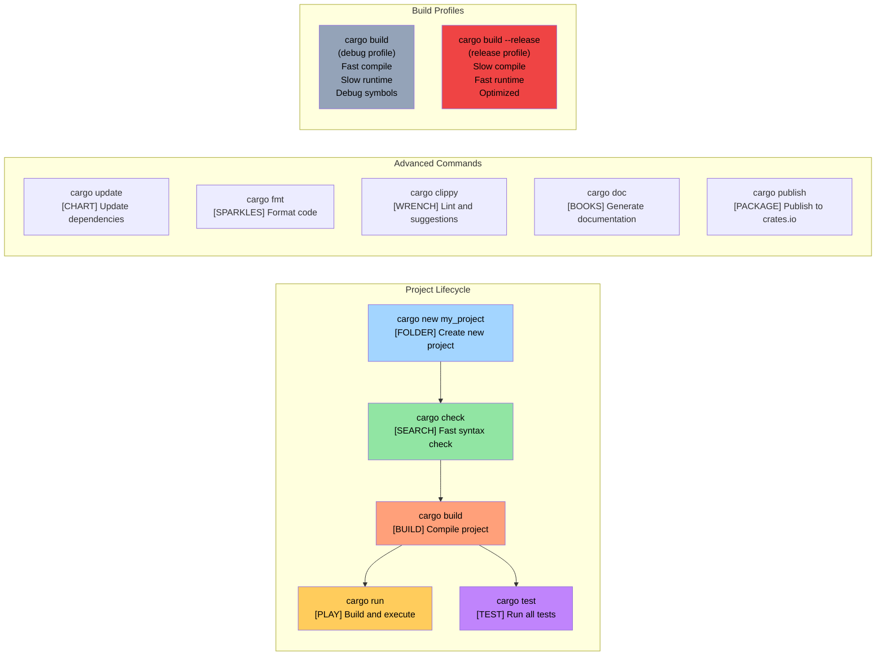

# 废话少说：给我看些代码

> **你将学到什么：** 你的第一个 Rust 程序——`fn main()`、`println!()`，以及 Rust 宏如何从根本上不同于 C/C++ 预处理器宏。到最后你将能够编写、编译和运行简单的 Rust 程序。

```rust
fn main() {
    println!("Hello world from Rust");
}
```
- 上述语法对熟悉 C 风格语言的人应该很相似
    - Rust 中的所有函数以 `fn` 关键字开头
    - 可执行文件的默认入口点是 `main()`
    - `println!` 看起来像一个函数，但实际上是**宏**。Rust 中的宏与 C/C++ 预处理器宏完全不同——它们是卫生的、类型安全的，并且对语法树进行操作而不是文本替换
- 快速尝试 Rust 代码片段的两种绝佳方式：
    - **在线**：[Rust Playground](https://play.rust-lang.org/) — 粘贴代码，点击运行，分享结果。无需安装
    - **本地 REPL**：安装 [`evcxr_repl`](https://github.com/evcxr/evcxr) 以获得交互式 Rust REPL（就像 Python 的 REPL，但用于 Rust）：
```bash
cargo install --locked evcxr_repl
evcxr   # Start the REPL, type Rust expressions interactively
```

### Rust 本地安装
- Rust 可以使用以下方法本地安装
    - Windows：https://static.rust-lang.org/rustup/dist/x86_64-pc-windows-msvc/rustup-init.exe
    - Linux / WSL：`curl --proto '=https' --tlsv1.2 -sSf https://sh.rustup.rs | sh`
- Rust 生态系统由以下组件组成
    - `rustc` 是独立的编译器，但很少直接使用
    - 首选工具 `cargo` 是瑞士军刀，用于依赖管理、构建、测试、格式化、代码检查等
    - Rust 工具链有 `stable`、`beta` 和 `nightly`（实验性）通道，但我们坚持使用 `stable`。使用 `rustup update` 命令升级每六周发布一次的 `stable` 安装
- 我们还将为 VSCode 安装 `rust-analyzer` 插件

# Rust 包（crates）
- Rust 二进制文件使用包（以下简称 crates）创建
    - crate 可以是独立的，也可以依赖其他 crates。依赖的 crates 可以是本地的或远程的。第三方 crates 通常从名为 `crates.io` 的集中式仓库下载。
    - `cargo` 工具自动处理 crates 及其依赖的下载。这在概念上等同于链接 C 库
    - crate 依赖在名为 `Cargo.toml` 的文件中表达。它还定义了 crate 的目标类型：独立可执行文件、静态库、动态库（不常见）
    - 参考：https://doc.rust-lang.org/cargo/reference/cargo-targets.html

## Cargo vs 传统 C 构建系统

### 依赖管理比较



### Cargo 项目结构

```text
my_project/
|-- Cargo.toml          # 项目配置（类似于 package.json）
|-- Cargo.lock          # 精确的依赖版本（自动生成）
|-- src/
|   |-- main.rs         # 二进制文件的主入口点
|   |-- lib.rs          # 库根（如果创建库）
|   `-- bin/            # 额外的二进制目标
|-- tests/              # 集成测试
|-- examples/           # 示例代码
|-- benches/            # 基准测试
`-- target/             # 构建产物（类似于 C 的 build/ 或 obj/）
    |-- debug/          # 调试构建（快速编译，慢运行时）
    `-- release/        # 发布构建（慢编译，快运行时）
```

### 常用 Cargo 命令



# 示例：cargo 和 crates
- 在这个例子中，我们有一个独立的可执行 crate，没有其他依赖
- 使用以下命令创建一个名为 `helloworld` 的新 crate
```bash
cargo new helloworld
cd helloworld
cat Cargo.toml
```
- 默认情况下，`cargo run` 会编译并运行 crate 的 `debug`（未优化）版本。要执行 `release` 版本，使用 `cargo run --release`
- 注意实际二进制文件位于 `target` 文件夹下的 `debug` 或 `release` 文件夹中
- 我们可能还注意到源文件夹中有一个名为 `Cargo.lock` 的文件。它是自动生成的，不应手动修改
    - 我们稍后会重温 `Cargo.lock` 的具体用途


