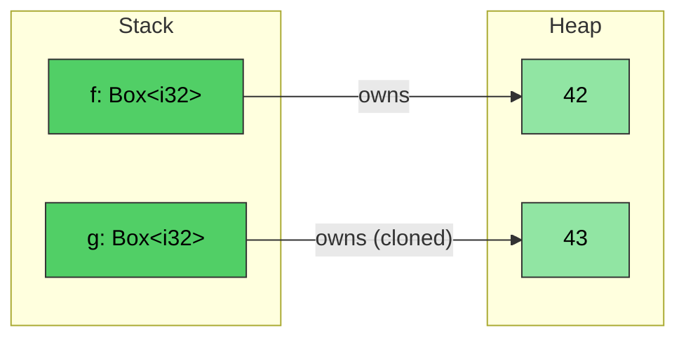
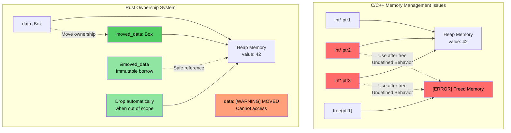
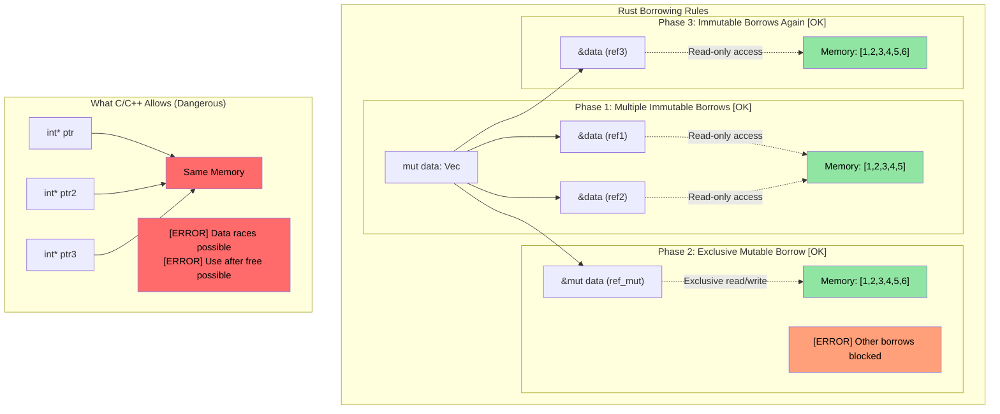

# Rust `Box<T>`

> **你将学到什么：** Rust 的智能指针类型——用于堆分配的 `Box<T>`、用于共享所有权的 `Rc<T>`，以及用于内部可变性的 `Cell<T>`/`RefCell<T>`。这些建立在前面章节的所有权和生命周期概念之上。你还将看到对用于打破引用循环的 `Weak<T>` 的简要介绍。

**为什么使用 `Box<T>`？** 在 C 中，你使用 `malloc`/`free` 进行堆分配。在 C++ 中，`std::unique_ptr<T>` 包装 `new`/`delete`。Rust 的 `Box<T>` 是等价物——一个堆分配的、单一所有者的指针，在超出作用域时自动释放。与 `malloc` 不同，没有要忘记的匹配 `free`。与 `unique_ptr` 不同，没有使用后移动——编译器完全阻止它。

**何时使用 `Box` vs 栈分配：**
- 所包含的类型很大，你不想在栈上拷贝它
- 你需要一个递归类型（例如，包含自身的链表节点）
- 你需要 trait 对象（`Box<dyn Trait>`）

- ```Box<T>``` can be use to create a pointer to a heap allocated type. The pointer is always a fixed size regardless of the type of ```<T>```
```rust
fn main() {
    // Creates a pointer to an integer (with value 42) created on the heap
    let f = Box::new(42);
    println!("{} {}", *f, f);
    // Cloning a box creates a new heap allocation
    let mut g = f.clone();
    *g = 43;
    println!("{f} {g}");
    // g and f go out of scope here and are automatically deallocated
}
```


## 所有权和借用可视化

### C/C++ vs Rust：指针和所有权管理

```c
// C - Manual memory management, potential issues
void c_pointer_problems() {
    int* ptr1 = malloc(sizeof(int));
    *ptr1 = 42;
    
    int* ptr2 = ptr1;  // Both point to same memory
    int* ptr3 = ptr1;  // Three pointers to same memory
    
    free(ptr1);        // Frees the memory
    
    *ptr2 = 43;        // Use after free - undefined behavior!
    *ptr3 = 44;        // Use after free - undefined behavior!
}
```

> **For C++ developers:** Smart pointers help, but don't prevent all issues:
>
> ```cpp
> // C++ - Smart pointers help, but don't prevent all issues
> void cpp_pointer_issues() {
>     auto ptr1 = std::make_unique<int>(42);
>     
>     // auto ptr2 = ptr1;  // Compile error: unique_ptr not copyable
>     auto ptr2 = std::move(ptr1);  // OK: ownership transferred
>     
>     // But C++ still allows use-after-move:
>     // std::cout << *ptr1;  // Compiles! But undefined behavior!
>     
>     // shared_ptr aliasing:
>     auto shared1 = std::make_shared<int>(42);
>     auto shared2 = shared1;  // Both own the data
>     // Who "really" owns it? Neither. Ref count overhead everywhere.
> }
> ```

```rust
// Rust - Ownership system prevents these issues
fn rust_ownership_safety() {
    let data = Box::new(42);  // data owns the heap allocation
    
    let moved_data = data;    // Ownership transferred to moved_data
    // data is no longer accessible - compile error if used
    
    let borrowed = &moved_data;  // Immutable borrow
    println!("{}", borrowed);    // Safe to use
    
    // moved_data automatically freed when it goes out of scope
}
```



### 借用规则可视化

```rust
fn borrowing_rules_example() {
    let mut data = vec![1, 2, 3, 4, 5];
    
    // Multiple immutable borrows - OK
    let ref1 = &data;
    let ref2 = &data;
    println!("{:?} {:?}", ref1, ref2);  // Both can be used
    
    // Mutable borrow - exclusive access
    let ref_mut = &mut data;
    ref_mut.push(6);
    // ref1 and ref2 can't be used while ref_mut is active
    
    // After ref_mut is done, immutable borrows work again
    let ref3 = &data;
    println!("{:?}", ref3);
}
```



---

## 内部可变性：`Cell<T>` 和 `RefCell<T>`

回想一下，默认情况下 Rust 中的变量是不可变的。有时希望让类型的大部分只读，同时允许对单个字段进行写访问。

```rust
struct Employee {
    employee_id : u64,   // This must be immutable
    on_vacation: bool,   // What if we wanted to permit write-access to this field, but make employee_id immutable?
}
```

- 回想一下，Rust 允许对变量有*单个可变*引用和任意数量的*不可变*引用——在*编译时*强制执行
- 如果我们想传递一个*不可变*的员工向量，*但*允许更新 `on_vacation` 字段，同时确保 `employee_id` 不能被改变，该怎么办？

### `Cell<T>` — Copy 类型的内部可变性

- `Cell<T>` 提供**内部可变性**，即对原本只读的引用的特定元素进行写访问
- 通过将值移入移出来工作（`.get()` 需要 `T: Copy`）

### `RefCell<T>` — 带运行时借用检查的内部可变性

- `RefCell<T>` 提供一种适用于引用的变体
    - 在**运行时**而不是编译时强制执行 Rust 借用检查
    - 允许单个*可变*借用，但如果有任何其他引用存在，则**panic**
    - 使用 `.borrow()` 进行不可变访问，使用 `.borrow_mut()` 进行可变访问

### 何时选择 `Cell` vs `RefCell`

| 标准 | `Cell<T>` | `RefCell<T>` |
|-----------|-----------|-------------|
| 适用于 | `Copy` 类型（整数、布尔、浮点） | 任何类型（`String`、`Vec`、结构体） |
| 访问模式 | 移入移出值（`.get()`、`.set()`） | 就地借用（`.borrow()`、`.borrow_mut()`） |
| 失败模式 | 不会失败——无运行时检查 | 如果在另一个借用活跃时可变借用，则**panic** |
| 开销 | 零——只是拷贝字节 | 小——在运行时跟踪借用状态 |
| 何时使用 | 你需要在不可变结构体内部设置一个可变标志、计数器或小值 | 你需要在一个不可变结构体内部改变一个 `String`、`Vec` 或复杂类型 |

---

## 共享所有权：`Rc<T>`

`Rc<T>` 允许对*不可变*数据进行引用计数的共享所有权。如果我们想在多个地方存储相同的 `Employee` 而不拷贝，该怎么办？

```rust
#[derive(Debug)]
struct Employee {
    employee_id: u64,
}
fn main() {
    let mut us_employees = vec![];
    let mut all_global_employees = Vec::<Employee>::new();
    let employee = Employee { employee_id: 42 };
    us_employees.push(employee);
    // Won't compile — employee was already moved
    //all_global_employees.push(employee);
}
```

`Rc<T>` solves the problem by allowing shared *immutable* access:
- The contained type is automatically dereferenced
- The type is dropped when the reference count goes to 0

```rust
use std::rc::Rc;
#[derive(Debug)]
struct Employee {employee_id: u64}
fn main() {
    let mut us_employees = vec![];
    let mut all_global_employees = vec![];
    let employee = Employee { employee_id: 42 };
    let employee_rc = Rc::new(employee);
    us_employees.push(employee_rc.clone());
    all_global_employees.push(employee_rc.clone());
    let employee_one = all_global_employees.get(0); // Shared immutable reference
    for e in us_employees {
        println!("{}", e.employee_id);  // Shared immutable reference
    }
    println!("{employee_one:?}");
}
```

> **For C++ developers: Smart Pointer Mapping**
>
> | C++ Smart Pointer | Rust Equivalent | Key Difference |
> |---|---|---|
> | `std::unique_ptr<T>` | `Box<T>` | Rust's version is the default — move is language-level, not opt-in |
> | `std::shared_ptr<T>` | `Rc<T>` (single-thread) / `Arc<T>` (multi-thread) | No atomic overhead for `Rc`; use `Arc` only when sharing across threads |
> | `std::weak_ptr<T>` | `Weak<T>` (from `Rc::downgrade()` or `Arc::downgrade()`) | Same purpose: break reference cycles |
>
> **Key distinction**: In C++, you *choose* to use smart pointers. In Rust, owned values (`T`) and borrowing (`&T`) cover most use cases — reach for `Box`/`Rc`/`Arc` only when you need heap allocation or shared ownership.

### 使用 `Weak<T>` 打破引用循环

`Rc<T>` 使用引用计数——如果两个 `Rc` 值相互指向，则两者都不会被删除（循环）。`Weak<T>` 解决了这个问题：

```rust
use std::rc::{Rc, Weak};

struct Node {
    value: i32,
    parent: Option<Weak<Node>>,  // Weak reference — doesn't prevent drop
}

fn main() {
    let parent = Rc::new(Node { value: 1, parent: None });
    let child = Rc::new(Node {
        value: 2,
        parent: Some(Rc::downgrade(&parent)),  // Weak ref to parent
    });

    // To use a Weak, try to upgrade it — returns Option<Rc<T>>
    if let Some(parent_rc) = child.parent.as_ref().unwrap().upgrade() {
        println!("Parent value: {}", parent_rc.value);
    }
    println!("Parent strong count: {}", Rc::strong_count(&parent)); // 1, not 2
}
```

> `Weak<T>` is covered in more depth in [Avoiding Excessive clone()](ch17-1-avoiding-excessive-clone.md). For now, the key takeaway: **use `Weak` for "back-references" in tree/graph structures to avoid memory leaks.**

---

## 结合 `Rc` 与内部可变性

当你将 `Rc<T>`（共享所有权）与 `Cell<T>` 或 `RefCell<T>`（内部可变性）结合时，真正的力量就显现了。这让多个所有者**读取和修改**共享数据：

| 模式 | 用例 |
|---------|----------|
| `Rc<RefCell<T>>` | 共享的可变数据（单线程） |
| `Arc<Mutex<T>>` | 共享的可变数据（多线程——见 [ch13](ch13-concurrency.md)） |
| `Rc<Cell<T>>` | 共享的可变 Copy 类型（简单标志、计数器） |

---

# 练习：共享所有权和内部可变性

🟡 **中级**

- **第 1 部分（Rc）**：创建一个带有 `employee_id: u64` 和 `name: String` 的 `Employee` 结构体。将其放入 `Rc<Employee>` 并克隆到两个单独的 `Vec`（`us_employees` 和 `global_employees`）。从两个向量打印以显示它们共享相同的数据。
- **第 2 部分（Cell）**：向 `Employee` 添加 `on_vacation: Cell<bool>` 字段。传递一个不可变的 `&Employee` 引用给函数，并从该函数内部切换 `on_vacation`——而不使引用可变。
- **第 3 部分（RefCell）**：将 `name: String` 替换为 `name: RefCell<String>`，并编写一个函数，通过 `&Employee`（不可变引用）向员工姓名追加后缀。

**起始代码：**
```rust
use std::cell::{Cell, RefCell};
use std::rc::Rc;

#[derive(Debug)]
struct Employee {
    employee_id: u64,
    name: RefCell<String>,
    on_vacation: Cell<bool>,
}

fn toggle_vacation(emp: &Employee) {
    // TODO: Flip on_vacation using Cell::set()
}

fn append_title(emp: &Employee, title: &str) {
    // TODO: Borrow name mutably via RefCell and push_str the title
}

fn main() {
    // TODO: Create an employee, wrap in Rc, clone into two Vecs,
    // call toggle_vacation and append_title, print results
}
```

<details><summary>Solution (click to expand)</summary>

```rust
use std::cell::{Cell, RefCell};
use std::rc::Rc;

#[derive(Debug)]
struct Employee {
    employee_id: u64,
    name: RefCell<String>,
    on_vacation: Cell<bool>,
}

fn toggle_vacation(emp: &Employee) {
    emp.on_vacation.set(!emp.on_vacation.get());
}

fn append_title(emp: &Employee, title: &str) {
    emp.name.borrow_mut().push_str(title);
}

fn main() {
    let emp = Rc::new(Employee {
        employee_id: 42,
        name: RefCell::new("Alice".to_string()),
        on_vacation: Cell::new(false),
    });

    let mut us_employees = vec![];
    let mut global_employees = vec![];
    us_employees.push(Rc::clone(&emp));
    global_employees.push(Rc::clone(&emp));

    // Toggle vacation through an immutable reference
    toggle_vacation(&emp);
    println!("On vacation: {}", emp.on_vacation.get()); // true

    // Append title through an immutable reference
    append_title(&emp, ", Sr. Engineer");
    println!("Name: {}", emp.name.borrow()); // "Alice, Sr. Engineer"

    // Both Vecs see the same data (Rc shares ownership)
    println!("US: {:?}", us_employees[0].name.borrow());
    println!("Global: {:?}", global_employees[0].name.borrow());
    println!("Rc strong count: {}", Rc::strong_count(&emp));
}
// Output:
// On vacation: true
// Name: Alice, Sr. Engineer
// US: "Alice, Sr. Engineer"
// Global: "Alice, Sr. Engineer"
// Rc strong count: 3
```

</details>
