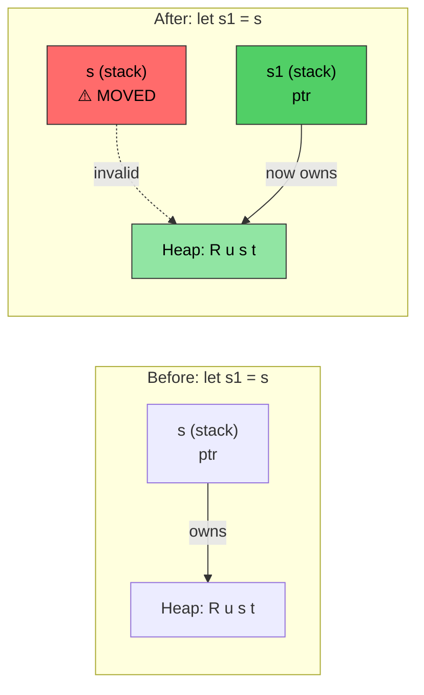
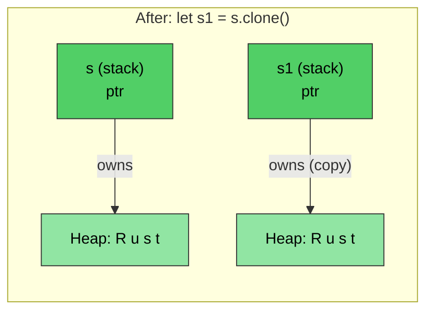

# Rust 内存管理

> **你将学到什么：** Rust 的所有权系统——这是语言中最重要的概念。学完本章后，你会理解移动语义、借用规则和 `Drop` trait。如果你掌握了本章，Rust 的其余部分就会顺理成章。如果你感到吃力，请重读——对于大多数 C/C++ 开发者来说，所有权在第二遍阅读时会豁然开朗。

- C/C++ 中的内存管理是 bug 的来源：
    - 在 C 中：内存用 `malloc()` 分配，用 `free()` 释放。没有针对野指针、使用后释放或双重释放的检查
    - 在 C++ 中：RAII（资源获取即初始化）和智能指针有帮助，但 `std::move(ptr)` 在移动后仍然可以编译——使用后移动是 UB
- Rust 使 RAII **万无一失**：
    - 移动是**破坏性的**——编译器拒绝让你触碰移动后的变量
    - 不需要五条规则（无拷贝构造函数、移动构造函数、拷贝赋值、移动赋值、析构函数）
    - Rust 提供对内存分配的完全控制，但在**编译时**强制执行安全性
    - 这是通过所有权、借用、可变性和生命周期的组合机制实现的
    - Rust 运行时分配可以在栈和堆上进行

> **对于 C++ 开发者——智能指针映射：**
>
> | **C++** | **Rust** | **安全性改进** |
> |---------|----------|----------------------|
> | `std::unique_ptr<T>` | `Box<T>` | 不可能使用后移动 |
> | `std::shared_ptr<T>` | `Rc<T>`（单线程） | 默认无引用循环 |
> | `std::shared_ptr<T>`（线程安全） | `Arc<T>` | 显式线程安全 |
> | `std::weak_ptr<T>` | `Weak<T>` | 必须检查有效性 |
> | 原始指针 | `*const T` / `*mut T` | 仅在 `unsafe` 块中 |
>
> 对于 C 开发者：`Box<T>` 替代 `malloc`/`free` 对。`Rc<T>` 替代手动引用计数。原始指针存在但仅限于 `unsafe` 块。

# Rust 所有权、借用和生命周期
- 回想一下，Rust 只允许对变量有一个可变引用和多个只读引用
    - 变量的初始声明建立**所有权**
    - 后续引用从原始所有者**借用**。规则是借用的作用域永远不能超过所属作用域。换句话说，借用的 **lifetime** 不能超过所属 lifetime
```rust
fn main() {
    let a = 42; // Owner
    let b = &a; // First borrow
    {
        let aa = 42;
        let c = &a; // Second borrow; a is still in scope
        // Ok: c goes out of scope here
        // aa goes out of scope here
    }
    // let d = &aa; // Will not compile unless aa is moved to outside scope
    // b implicitly goes out of scope before a
    // a goes out of scope last
}
```

- Rust 可以使用几种不同的机制将参数传递给方法
    - 按值（拷贝）：通常是能够简单拷贝的类型（例如：u8、u32、i8、i32）
    - 通过引用：这相当于传递指向实际值的指针。这也就是通常所说的借用，引用可以是不可变的（`&`）或可变的（`&mut`）
    - 通过移动：这将值的"所有权"转移给函数。调用者不能再引用原始值
```rust
fn foo(x: &u32) {
    println!("{x}");
}
fn bar(x: u32) {
    println!("{x}");
}
fn main() {
    let a = 42;
    foo(&a);    // By reference
    bar(a);     // By value (copy)
}
```

- Rust 禁止方法中的悬空引用
    - 方法返回的引用必须仍然在作用域内
    - Rust 将在引用超出作用域时自动 `drop` 它。 
```rust
fn no_dangling() -> &u32 {
    // lifetime of a begins here
    let a = 42;
    // Won't compile. lifetime of a ends here
    &a
}

fn ok_reference(a: &u32) -> &u32 {
    // Ok because the lifetime of a always exceeds ok_reference()
    a
}
fn main() {
    let a = 42;     // lifetime of a begins here
    let b = ok_reference(&a);
    // lifetime of b ends here
    // lifetime of a ends here
}
```

# Rust 移动语义
- 默认情况下，Rust 赋值转移所有权
```rust
fn main() {
    let s = String::from("Rust");    // Allocate a string from the heap
    let s1 = s; // Transfer ownership to s1. s is invalid at this point
    println!("{s1}");
    // This will not compile
    //println!("{s}");
    // s1 goes out of scope here and the memory is deallocated
    // s goes out of scope here, but nothing happens because it doesn't own anything
}
```

*在 `let s1 = s` 之后，所有权转移到 `s1`。堆数据保持不变——只有栈指针移动。`s` 现在无效。*

----
# Rust 移动语义和借用
```rust
fn foo(s : String) {
    println!("{s}");
    // The heap memory pointed to by s will be deallocated here
}
fn bar(s : &String) {
    println!("{s}");
    // Nothing happens -- s is borrowed
}
fn main() {
    let s = String::from("Rust string move example");    // Allocate a string from the heap
    foo(s); // Transfers ownership; s is invalid now
    // println!("{s}");  // will not compile
    let t = String::from("Rust string borrow example");
    bar(&t);    // t continues to hold ownership
    println!("{t}"); 
}
```

# Rust 移动语义和所有权
- 可以通过移动转移所有权
    - 在移动完成后引用现有引用是非法的
    - 如果不需要移动，考虑借用
```rust
struct Point {
    x: u32,
    y: u32,
}
fn consume_point(p: Point) {
    println!("{} {}", p.x, p.y);
}
fn borrow_point(p: &Point) {
    println!("{} {}", p.x, p.y);
}
fn main() {
    let p = Point {x: 10, y: 20};
    // Try flipping the two lines
    borrow_point(&p);
    consume_point(p);
}
```

# Rust Clone
- The ```clone()``` method can be used to copy the original memory. The original reference continues to be valid (the downside is that we have 2x the allocation)
```rust
fn main() {
    let s = String::from("Rust");    // Allocate a string from the heap
    let s1 = s.clone(); // Copy the string; creates a new allocation on the heap
    println!("{s1}");  
    println!("{s}");
    // s1 goes out of scope here and the memory is deallocated
    // s goes out of scope here, and the memory is deallocated
}
```

*`clone()` 创建**独立的**堆分配。`s` 和 `s1` 都有效——每个都有自己的副本。*

# Rust Copy trait
- Rust 使用 `Copy` trait 为内置类型实现拷贝语义
    - 示例包括 u8、u32、i8、i32 等。拷贝语义使用"按值传递"
    - 用户定义的数据类型可以选择使用 `derive` 宏加入 `copy` 语义，以自动实现 `Copy` trait
    - 编译器将在新赋值后为副本分配空间
```rust
// Try commenting this out to see the change in let p1 = p; belw
#[derive(Copy, Clone, Debug)]   // We'll discuss this more later
struct Point{x: u32, y:u32}
fn main() {
    let p = Point {x: 42, y: 40};
    let p1 = p;     // This will perform a copy now instead of move
    println!("p: {p:?}");
    println!("p1: {p:?}");
    let p2 = p1.clone();    // Semantically the same as copy
}
```

# Rust Drop trait

- Rust 在作用域结束时自动调用 `drop()` 方法
    - `drop` 是一个名为 `Drop` 的通用 trait 的一部分。编译器为所有类型提供了全覆盖的 NOP 实现，但类型可以覆盖它。例如，`String` 类型覆盖它以释放堆分配的内存
    - 对于 C 开发者：这取代了手动 `free()` 调用——资源在超出作用域时自动释放（RAII）
- **关键安全性：** 你不能直接调用 `.drop()`（编译器禁止它）。相反，使用 `drop(obj)`，它将值移动到函数中，运行其析构函数，并阻止任何进一步使用——消除双重释放 bug

> **对于 C++ 开发者：** `Drop` 直接映射到 C++ 析构函数（`~ClassName()`）：
>
> | | **C++ 析构函数** | **Rust `Drop`** |
> |---|---|---|
> | **语法** | `~MyClass() { ... }` | `impl Drop for MyType { fn drop(&mut self) { ... } }` |
> | **何时调用** | 作用域结束时（RAII） | 作用域结束时（相同） |
> | **移动时调用** | 源对象处于"有效但未指定"状态——析构函数仍在移动后的对象上运行 | 源对象**消失**——移动后的值不调用析构函数 |
> | **手动调用** | `obj.~MyClass()`（危险，很少使用） | `drop(obj)`（安全——获取所有权，调用 `drop`，阻止进一步使用） |
> | **顺序** | 逆声明顺序 | 逆声明顺序（相同） |
> | **五条规则** | 必须管理拷贝构造函数、移动构造函数、拷贝赋值、移动赋值、析构函数 | 只需 `Drop`——编译器处理移动语义，`Clone` 是可选的 |
> | **需要虚析构函数？** | 是的，如果通过基指针删除 | 否——无继承，所以没有切片问题 |

```rust
struct Point {x: u32, y:u32}

// Equivalent to: ~Point() { printf("Goodbye point x:%u, y:%u\n", x, y); }
impl Drop for Point {
    fn drop(&mut self) {
        println!("Goodbye point x:{}, y:{}", self.x, self.y);
    }
}
fn main() {
    let p = Point{x: 42, y: 42};
    {
        let p1 = Point{x:43, y: 43};
        println!("Exiting inner block");
        // p1.drop() called here — like C++ end-of-scope destructor
    }
    println!("Exiting main");
    // p.drop() called here
}
```

# 练习：移动、拷贝和 Drop

🟡 **中级** — 自由实验；编译器会引导你
- 使用 `#[derive(Debug)]` 中的 `Point` 创建你自己的实验，有和没有 `Copy`，确保你理解其中的差异。目的是获得对移动 vs. 拷贝工作方式的坚实理解，所以一定要问
- 为 `Point` 实现一个自定义 `Drop`，在 `drop` 中将 x 和 y 设置为 0。这是一个有用的模式，例如用于释放锁和其他资源
```rust
struct Point{x: u32, y: u32}
fn main() {
    // Create Point, assign it to a different variable, create a new scope,
    // pass point to a function, etc.
}
```

<details><summary>解决方案（点击展开）</summary>

```rust
#[derive(Debug)]
struct Point { x: u32, y: u32 }

impl Drop for Point {
    fn drop(&mut self) {
        println!("Dropping Point({}, {})", self.x, self.y);
        self.x = 0;
        self.y = 0;
        // Note: setting to 0 in drop demonstrates the pattern,
        // but you can't observe these values after drop completes
    }
}

fn consume(p: Point) {
    println!("Consuming: {:?}", p);
    // p is dropped here
}

fn main() {
    let p1 = Point { x: 10, y: 20 };
    let p2 = p1;  // Move — p1 is no longer valid
    // println!("{:?}", p1);  // Won't compile: p1 was moved

    {
        let p3 = Point { x: 30, y: 40 };
        println!("p3 in inner scope: {:?}", p3);
        // p3 is dropped here (end of scope)
    }

    consume(p2);  // p2 is moved into consume and dropped there
    // println!("{:?}", p2);  // Won't compile: p2 was moved

    // Now try: add #[derive(Copy, Clone)] to Point (and remove the Drop impl)
    // and observe how p1 remains valid after let p2 = p1;
}
// Output:
// p3 in inner scope: Point { x: 30, y: 40 }
// Dropping Point(30, 40)
// Consuming: Point { x: 10, y: 20 }
// Dropping Point(10, 20)
```

</details>


