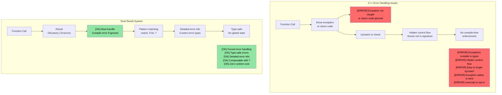
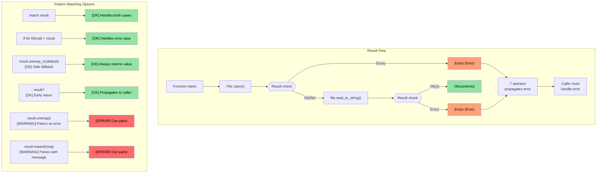

## 将枚举连接到 Option 和 Result

> **你将学到什么：** Rust 如何用 `Option<T>` 替代空指针，用 `Result<T, E>` 替代异常，以及 `?` 操作符如何使错误传播简洁。这是 Rust 最独特的模式——错误是值，不是隐藏的控制流。

- 还记得我们之前学的 `enum` 类型吗？Rust 的 `Option` 和 `Result` 只是标准库中定义的枚举：
```rust
// This is literally how Option is defined in std:
enum Option<T> {
    Some(T),  // Contains a value
    None,     // No value
}

// And Result:
enum Result<T, E> {
    Ok(T),    // Success with value
    Err(E),   // Error with details
}
```
- This means everything you learned about pattern matching with `match` works directly with `Option` and `Result`
- There is **no null pointer** in Rust -- `Option<T>` is the replacement, and the compiler forces you to handle the `None` case

### C++ 比较：异常 vs Result
| **C++ 模式** | **Rust 等价物** | **优势** |
|----------------|--------------------|--------------|
| `throw std::runtime_error(msg)` | `Err(MyError::Runtime(msg))` | 错误在返回类型中——不能忘记处理 |
| `try { } catch (...) { }` | `match result { Ok(v) => ..., Err(e) => ... }` | 无隐藏控制流 |
| `std::optional<T>` | `Option<T>` | 需要穷举匹配——不能忘记 None |
| `noexcept` 注解 | 默认——所有 Rust 函数都是 "noexcept" | 异常不存在 |
| `errno` / 返回码 | `Result<T, E>` | 类型安全，不能忽略 |

# Rust Option 类型
- Rust 的 `Option` 类型是一个只有两个变体的 `enum`：`Some<T>` 和 `None`
    - 这个想法是它代表一个 `nullable` 类型，即它要么包含该类型的有效值（`Some<T>`），要么没有有效值（`None`）
    - `Option` 类型用于 API，结果是操作要么成功并返回有效值，要么失败（但具体错误无关紧要）。例如，考虑解析字符串为整数值
```rust
fn main() {
    // Returns Option<usize>
    let a = "1234".find("1");
    match a {
        Some(a) => println!("Found 1 at index {a}"),
        None => println!("Couldn't find 1")
    }
}
```

# Rust Option 类型
- Rust 的 `Option` 可以用多种方式处理
    - `unwrap()` 如果 `Option<T>` 是 `None` 则 panic，否则返回 `T`，这是最不推荐的方法
    - `or()` 可用于返回替代值
    `if let` 让我们测试 `Some<T>`

> **生产模式**：参见 [使用 unwrap_or 的安全值提取](ch17-2-avoiding-unchecked-indexing.md#safe-value-extraction-with-unwrap_or) 和 [函数转换：map、map_err、find_map](ch17-2-avoiding-unchecked-indexing.md#functional-transforms-map-map_err-find_map) 了解生产 Rust 代码的真实示例。
```rust
fn main() {
  // This return an Option<usize>
  let a = "1234".find("1");
  println!("{a:?} {}", a.unwrap());
  let a = "1234".find("5").or(Some(42));
  println!("{a:?}");
  if let Some(a) = "1234".find("1") {
      println!("{a}");
  } else {
    println!("Not found in string");
  }
  // This will panic
  // "1234".find("5").unwrap();
}
```

# Rust Result 类型
- Result 是一个类似于 `Option` 的 `enum` 类型，有两个变体：`Ok<T>` 或 `Err<E>`
    - `Result` 在可能失败的 Rust API 中广泛使用。想法是，在成功时，函数返回 `Ok<T>`，或者它们返回特定错误 `Err<T>`
```rust
  use std::num::ParseIntError;
  fn main() {
  let a : Result<i32, ParseIntError>  = "1234z".parse();
  match a {
      Ok(n) => println!("Parsed {n}"),
      Err(e) => println!("Parsing failed {e:?}"),
  }
  let a : Result<i32, ParseIntError>  = "1234z".parse().or(Ok(-1));
  println!("{a:?}");
  if let Ok(a) = "1234".parse::<i32>() {
    println!("Let OK {a}");  
  }
  // This will panic
  //"1234z".parse().unwrap();
}
```

## Option 和 Result：同一枚硬币的两面

`Option` 和 `Result` 深度相关——`Option<T>` 本质上是 `Result<T, ()>`（一个错误不携带信息的 result）：

| `Option<T>` | `Result<T, E>` | 含义 |
|-------------|---------------|---------|
| `Some(value)` | `Ok(value)` | 成功——值存在 |
| `None` | `Err(error)` | 失败——无值（Option）或错误详情（Result） |

**相互转换：**

```rust
fn main() {
    let opt: Option<i32> = Some(42);
    let res: Result<i32, &str> = opt.ok_or("value was None");  // Option → Result
    
    let res: Result<i32, &str> = Ok(42);
    let opt: Option<i32> = res.ok();  // Result → Option (discards error)
    
    // They share many of the same methods:
    // .map(), .and_then(), .unwrap_or(), .unwrap_or_else(), .is_some()/is_ok()
}
```

> **经验法则**：当缺席是正常的时使用 `Option`（例如，查找键）。当失败需要解释时使用 `Result`（例如，文件 I/O、解析）。

# 练习：使用 Option 实现 log() 函数

🟢 **入门级**

- Implement a ```log()``` function that accepts an ```Option<&str>``` parameter. If the parameter is ```None```, it should print a default string
- The function should return a ```Result``` with ```()``` for both success and error (in this case we'll never have an error)

<details><summary>Solution (click to expand)</summary>

```rust
fn log(message: Option<&str>) -> Result<(), ()> {
    match message {
        Some(msg) => println!("LOG: {msg}"),
        None => println!("LOG: (no message provided)"),
    }
    Ok(())
}

fn main() {
    let _ = log(Some("System initialized"));
    let _ = log(None);
    
    // Alternative using unwrap_or:
    let msg: Option<&str> = None;
    println!("LOG: {}", msg.unwrap_or("(default message)"));
}
// Output:
// LOG: System initialized
// LOG: (no message provided)
// LOG: (default message)
```

</details>

----
# Rust 错误处理
 - Rust 错误可以是不可恢复的（致命的）或可恢复的。致命错误导致 `panic`
    - 一般来说，应该避免导致 `panics` 的情况。`panics` 是由程序中的 bug 引起的，包括超出索引边界、在 `Option<None>` 上调用 `unwrap()` 等
    - 对于应该不可能的情况，使用显式 `panics` 是可以的。`panic!` 或 `assert!` 宏可用于完整性检查
```rust
fn main() {
   let x : Option<u32> = None;
   // println!("{x}", x.unwrap()); // Will panic
   println!("{}", x.unwrap_or(0));  // OK -- prints 0
   let x = 41;
   //assert!(x == 42); // Will panic
   //panic!("Something went wrong"); // Unconditional panic
   let _a = vec![0, 1];
   // println!("{}", a[2]); // Out of bounds panic; use a.get(2) which will return Option<T>
}
```

## 错误处理：C++ vs Rust

### C++ 基于异常的错误处理问题

```cpp
// C++ error handling - exceptions create hidden control flow
#include <fstream>
#include <stdexcept>

std::string read_config(const std::string& path) {
    std::ifstream file(path);
    if (!file.is_open()) {
        throw std::runtime_error("Cannot open: " + path);
    }
    std::string content;
    // What if getline throws? Is file properly closed?
    // With RAII yes, but what about other resources?
    std::getline(file, content);
    return content;  // What if caller doesn't try/catch?
}

int main() {
    // ERROR: Forgot to wrap in try/catch!
    auto config = read_config("nonexistent.txt");
    // Exception propagates silently, program crashes
    // Nothing in the function signature warned us
    return 0;
}
```



### `Result<T, E>` 可视化

```rust
// Rust error handling - comprehensive and forced
use std::fs::File;
use std::io::Read;

fn read_file_content(filename: &str) -> Result<String, std::io::Error> {
    let mut file = File::open(filename)?;  // ? automatically propagates errors
    let mut contents = String::new();
    file.read_to_string(&mut contents)?;
    Ok(contents)  // Success case
}

fn main() {
    match read_file_content("example.txt") {
        Ok(content) => println!("File content: {}", content),
        Err(error) => println!("Failed to read file: {}", error),
        // Compiler forces us to handle both cases!
    }
}
```



# Rust 错误处理
- Rust 使用 `enum Result<T, E>` 枚举进行可恢复错误处理
    - `Ok<T>` 变体在成功时包含结果，`Err<E>` 包含错误
```rust
fn main() {
    let x = "1234x".parse::<u32>();
    match x {
        Ok(x) => println!("Parsed number {x}"),
        Err(e) => println!("Parsing error {e:?}"),
    }
    let x  = "1234".parse::<u32>();
    // Same as above, but with valid number
    if let Ok(x) = &x {
        println!("Parsed number {x}")
    } else if let Err(e) = &x {
        println!("Error: {e:?}");
    }
}
```

# Rust 错误处理
- try 操作符 `?` 是 `match` `Ok` / `Err` 模式的便捷简写
    - 注意方法必须返回 `Result<T, E>` 才能使用 `?`
    - `Result<T, E>` 的类型可以改变。在下面的示例中，我们返回与 `str::parse()` 返回的相同错误类型（`std::num::ParseIntError`） 
```rust
fn double_string_number(s : &str) -> Result<u32, std::num::ParseIntError> {
   let x = s.parse::<u32>()?; // Returns immediately in case of an error
   Ok(x*2)
}
fn main() {
    let result = double_string_number("1234");
    println!("{result:?}");
    let result = double_string_number("1234x");
    println!("{result:?}");
}
```

# Rust 错误处理
- 错误可以映射到其他类型或默认值（https://doc.rust-lang.org/std/result/enum.Result.html#method.unwrap_or_default）
```rust
// Changes the error type to () in case of error
fn double_string_number(s : &str) -> Result<u32, ()> {
   let x = s.parse::<u32>().map_err(|_|())?; // Returns immediately in case of an error
   Ok(x*2)
}
```
```rust
fn double_string_number(s : &str) -> Result<u32, ()> {
   let x = s.parse::<u32>().unwrap_or_default(); // Defaults to 0 in case of parse error
   Ok(x*2)
}
```
```rust
fn double_optional_number(x : Option<u32>) -> Result<u32, ()> {
    // ok_or converts Option<None> to Result<u32, ()> in the below
    x.ok_or(()).map(|x|x*2) // .map() is applied only on Ok(u32)
}
```

# 练习：错误处理

🟡 **中级**
- 实现一个带有单个 u32 参数的 `log()` 函数。如果参数不是 42，返回错误。成功的 `Result<>` 和错误类型是 `()`
- 调用 `log()` 函数，如果 `log()` 返回错误则使用相同的 `Result<>` 类型退出。否则打印一条消息说明 log 被成功调用

```rust
fn log(x: u32) -> ?? {

}

fn call_log(x: u32) -> ?? {
    // Call log(x), then exit immediately if it return an error
    println!("log was successfully called");
}

fn main() {
    call_log(42);
    call_log(43);
}
``` 

<details><summary>Solution (click to expand)</summary>

```rust
fn log(x: u32) -> Result<(), ()> {
    if x == 42 {
        Ok(())
    } else {
        Err(())
    }
}

fn call_log(x: u32) -> Result<(), ()> {
    log(x)?;  // Exit immediately if log() returns an error
    println!("log was successfully called with {x}");
    Ok(())
}

fn main() {
    let _ = call_log(42);  // Prints: log was successfully called with 42
    let _ = call_log(43);  // Returns Err(()), nothing printed
}
// Output:
// log was successfully called with 42
```

</details>


