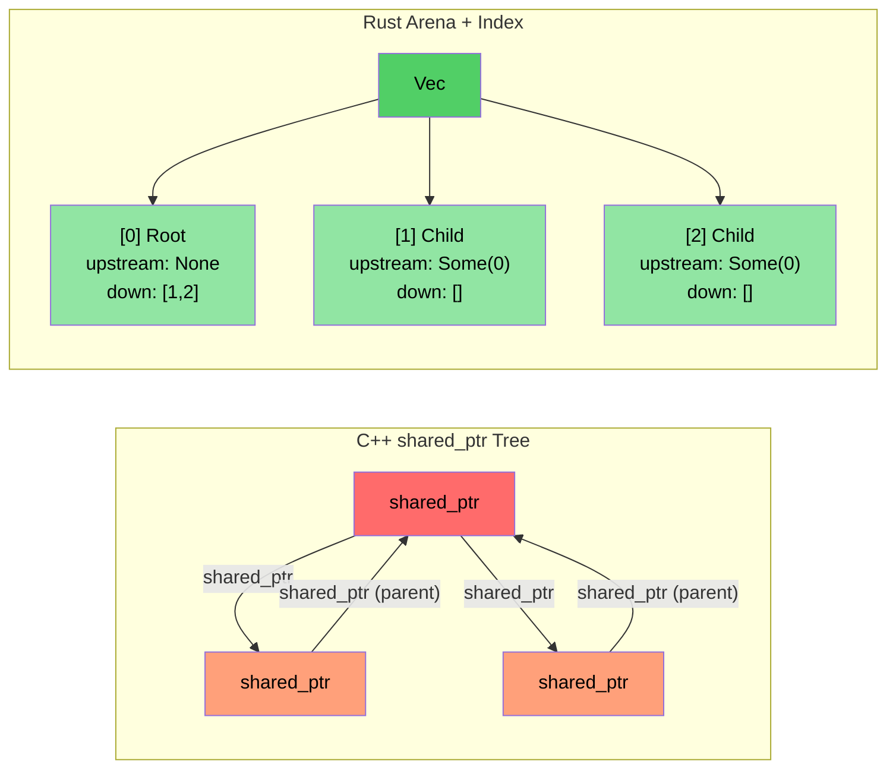

# 案例研究概述：C++ 到 Rust 的翻译

> **你将学到什么：** 从约 10 万行 C++ 到约 9 万行 Rust（跨越约 20 个 crate）的真实世界翻译的经验教训。五个关键转换模式和背后的架构决策。

- 我们将一个大型 C++ 诊断系统（约 10 万行 C++）翻译成 Rust 实现（约 20 个 Rust crate，约 9 万行）
- 本节展示**实际使用的模式**——不是玩具示例，而是真实的生成代码
- 五个关键转换：

| **#** | **C++ 模式** | **Rust 模式** | **影响** |
|-------|----------------|-----------------|-----------|
| 1 | 类层次结构 + `dynamic_cast` | 枚举分发 + `match` | ~400 → 0 dynamic_casts |
| 2 | `shared_ptr` / `enable_shared_from_this` 树 | Arena + 索引链接 | 无引用循环 |
| 3 | 每个模块中的 `Framework*` 原始指针 | 带生命周期借用的 `DiagContext<'a>` | 编译时有效性 |
| 4 | 上帝对象 | 可组合状态结构体 | 可测试、模块化 |
| 5 | 到处使用 `vector<unique_ptr<Base>>` | Trait 对象**仅**在需要时使用（约 25 处） | 默认静态分发 |

### 之前和之后指标

| **Metric** | **C++ (Original)** | **Rust (Rewrite)** |
|------------|---------------------|------------------------|
| `dynamic_cast` / type downcasts | ~400 | 0 |
| `virtual` / `override` methods | ~900 | ~25 (`Box<dyn Trait>`) |
| Raw `new` allocations | ~200 | 0 (all owned types) |
| `shared_ptr` / reference counting | ~10 (topology lib) | 0 (`Arc` only at FFI boundary) |
| `enum class` definitions | ~60 | ~190 `pub enum` |
| Pattern matching expressions | N/A | ~750 `match` |
| God objects (>5K lines) | 2 | 0 |

----

# 案例研究 1：继承层次结构 → 枚举分发

## C++ 模式：事件类层次结构
```cpp
// C++ original: Every GPU event type is a class inheriting from GpuEventBase
class GpuEventBase {
public:
    virtual ~GpuEventBase() = default;
    virtual void Process(DiagFramework* fw) = 0;
    uint16_t m_recordId;
    uint8_t  m_sensorType;
    // ... common fields
};

class GpuPcieDegradeEvent : public GpuEventBase {
public:
    void Process(DiagFramework* fw) override;
    uint8_t m_linkSpeed;
    uint8_t m_linkWidth;
};

class GpuPcieFatalEvent : public GpuEventBase { /* ... */ };
class GpuBootEvent : public GpuEventBase { /* ... */ };
// ... 10+ event classes inheriting from GpuEventBase

// Processing requires dynamic_cast:
void ProcessEvents(std::vector<std::unique_ptr<GpuEventBase>>& events,
                   DiagFramework* fw) {
    for (auto& event : events) {
        if (auto* degrade = dynamic_cast<GpuPcieDegradeEvent*>(event.get())) {
            // handle degrade...
        } else if (auto* fatal = dynamic_cast<GpuPcieFatalEvent*>(event.get())) {
            // handle fatal...
        }
        // ... 10 more branches
    }
}
```

## The Rust Solution: Enum Dispatch
```rust
// Example: types.rs — No inheritance, no vtable, no dynamic_cast
#[derive(Debug, Clone, PartialEq, Eq, Serialize, Deserialize)]
pub enum GpuEventKind {
    PcieDegrade,
    PcieFatal,
    PcieUncorr,
    Boot,
    BaseboardState,
    EccError,
    OverTemp,
    PowerRail,
    ErotStatus,
    Unknown,
}
```

```rust
// Example: manager.rs — Separate typed Vecs, no downcasting needed
pub struct GpuEventManager {
    sku: SkuVariant,
    degrade_events: Vec<GpuPcieDegradeEvent>,   // Concrete type, not Box<dyn>
    fatal_events: Vec<GpuPcieFatalEvent>,
    uncorr_events: Vec<GpuPcieUncorrEvent>,
    boot_events: Vec<GpuBootEvent>,
    baseboard_events: Vec<GpuBaseboardEvent>,
    ecc_events: Vec<GpuEccEvent>,
    // ... each event type gets its own Vec
}

// Accessors return typed slices — zero ambiguity
impl GpuEventManager {
    pub fn degrade_events(&self) -> &[GpuPcieDegradeEvent] {
        &self.degrade_events
    }
    pub fn fatal_events(&self) -> &[GpuPcieFatalEvent] {
        &self.fatal_events
    }
}
```

### Why Not `Vec<Box<dyn GpuEvent>>`?
- **The Wrong Approach** (literal translation): Put all events in one heterogeneous collection, then downcast — this is what C++ does with `vector<unique_ptr<Base>>`
- **The Right Approach**: Separate typed Vecs eliminate *all* downcasting. Each consumer asks for exactly the event type it needs
- **Performance**: Separate Vecs give better cache locality (all degrade events are contiguous in memory)

----

# Case Study 2: shared_ptr tree → Arena/index pattern

## The C++ Pattern: Reference-Counted Tree
```cpp
// C++ topology library: PcieDevice uses enable_shared_from_this 
// because parent and child nodes both need to reference each other
class PcieDevice : public std::enable_shared_from_this<PcieDevice> {
public:
    std::shared_ptr<PcieDevice> m_upstream;
    std::vector<std::shared_ptr<PcieDevice>> m_downstream;
    // ... device data
    
    void AddChild(std::shared_ptr<PcieDevice> child) {
        child->m_upstream = shared_from_this();  // Parent ↔ child cycle!
        m_downstream.push_back(child);
    }
};
// Problem: parent→child and child→parent create reference cycles
// Need weak_ptr to break cycles, but easy to forget
```

## The Rust Solution: Arena with Index Linkage
```rust
// Example: components.rs — Flat Vec owns all devices
pub struct PcieDevice {
    pub base: PcieDeviceBase,
    pub kind: PcieDeviceKind,

    // Tree linkage via indices — no reference counting, no cycles
    pub upstream_idx: Option<usize>,      // Index into the arena Vec
    pub downstream_idxs: Vec<usize>,      // Indices into the arena Vec
}

// The "arena" is simply a Vec<PcieDevice> owned by the tree:
pub struct DeviceTree {
    devices: Vec<PcieDevice>,  // Flat ownership — one Vec owns everything
}

impl DeviceTree {
    pub fn parent(&self, device_idx: usize) -> Option<&PcieDevice> {
        self.devices[device_idx].upstream_idx
            .map(|idx| &self.devices[idx])
    }
    
    pub fn children(&self, device_idx: usize) -> Vec<&PcieDevice> {
        self.devices[device_idx].downstream_idxs
            .iter()
            .map(|&idx| &self.devices[idx])
            .collect()
    }
}
```

### Key Insight
- **No `shared_ptr`, no `weak_ptr`, no `enable_shared_from_this`**
- **No reference cycles possible** — indices are just `usize` values
- **Better cache performance** — all devices in contiguous memory
- **Simpler reasoning** — one owner (the Vec), many viewers (indices)



----


