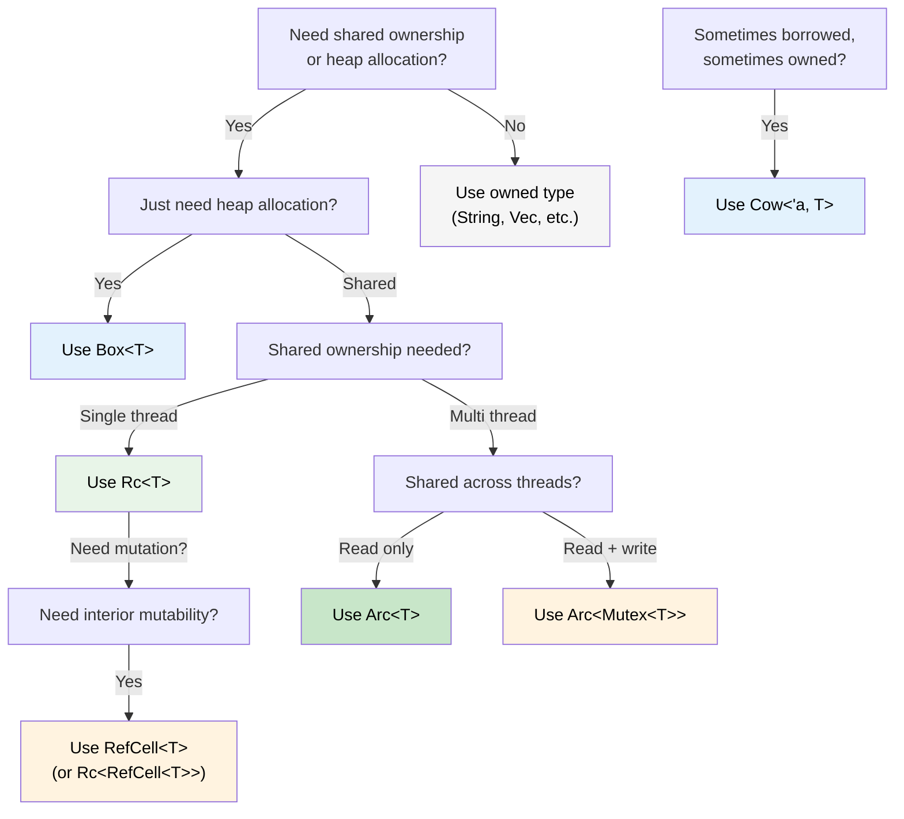

## 智能指针：当单一所有权不够时

> **学习内容：** `Box<T>`、`Rc<T>`、`Arc<T>`、`Cell<T>`、`RefCell<T>`和`Cow<'a, T>`——
> 何时使用每个、如何对比C#的GC管理引用、`Drop`作为Rust的`IDisposable`、
> `Deref`强制解引用，以及选择正确智能指针的决策树。
>
> **难度：** 🔴 高级

在C#中，每个对象本质上都由GC进行引用计数。在Rust中，单一所有权是默认的——但有时你需要共享所有权、堆分配或内部可变性。这就是智能指针的用武之地。

### Box&lt;T&gt; — 简单堆分配
```rust
// Stack allocation (default in Rust)
let x = 42;           // on the stack

// Heap allocation with Box
let y = Box::new(42); // on the heap, like C# `new int(42)` (boxed)
println!("{}", y);     // auto-derefs: prints 42

// Common use: recursive types (can't know size at compile time)
#[derive(Debug)]
enum List {
    Cons(i32, Box<List>),  // Box gives a known pointer size
    Nil,
}

let list = List::Cons(1, Box::new(List::Cons(2, Box::new(List::Nil))));
```

```csharp
// C# — everything on the heap already (reference types)
// Box<T> is only needed in Rust because stack is the default
var list = new LinkedListNode<int>(1);  // always heap-allocated
```

### Rc&lt;T&gt; — 共享所有权（单线程）
```rust
use std::rc::Rc;

// Multiple owners of the same data — like multiple C# references
let shared = Rc::new(vec![1, 2, 3]);
let clone1 = Rc::clone(&shared); // reference count: 2
let clone2 = Rc::clone(&shared); // reference count: 3

println!("Count: {}", Rc::strong_count(&shared)); // 3
// Data is dropped when last Rc goes out of scope

// Common use: shared configuration, graph nodes, tree structures
```

### Arc&lt;T&gt; — 共享所有权（线程安全）
```rust
use std::sync::Arc;
use std::thread;

// Arc = Atomic Reference Counting — safe to share across threads
let data = Arc::new(vec![1, 2, 3]);

let handles: Vec<_> = (0..3).map(|i| {
    let data = Arc::clone(&data);
    thread::spawn(move || {
        println!("Thread {i}: {:?}", data);
    })
}).collect();

for h in handles { h.join().unwrap(); }
```

```csharp
// C# — all references are thread-safe by default (GC handles it)
var data = new List<int> { 1, 2, 3 };
// Can share freely across threads (but mutation is still unsafe!)
```

### Cell&lt;T&gt;和RefCell&lt;T&gt; — 内部可变性
```rust
use std::cell::RefCell;

// Sometimes you need to mutate data behind a shared reference.
// RefCell moves borrow checking from compile time to runtime.
struct Logger {
    entries: RefCell<Vec<String>>,
}

impl Logger {
    fn new() -> Self {
        Logger { entries: RefCell::new(Vec::new()) }
    }

    fn log(&self, msg: &str) { // &self, not &mut self!
        self.entries.borrow_mut().push(msg.to_string());
    }

    fn dump(&self) {
        for entry in self.entries.borrow().iter() {
            println!("{entry}");
        }
    }
}
// ⚠️ RefCell panics at runtime if borrow rules are violated
// Use sparingly — prefer compile-time checking when possible
```

### Cow&lt;'a, str&gt; — 写时克隆
```rust
use std::borrow::Cow;

// Sometimes you have a &str that MIGHT need to become a String
fn normalize(input: &str) -> Cow<'_, str> {
    if input.contains('\t') {
        // Only allocate when we need to modify
        Cow::Owned(input.replace('\t', "    "))
    } else {
        // Borrow the original — zero allocation
        Cow::Borrowed(input)
    }
}

let clean = normalize("hello");           // Cow::Borrowed — no allocation
let dirty = normalize("hello\tworld");    // Cow::Owned — allocated
// Both can be used as &str via Deref
println!("{clean} / {dirty}");
```

### Drop：Rust的`IDisposable`

In C#, `IDisposable` + `using` handles resource cleanup. Rust's equivalent is the `Drop` trait — but it's **automatic**, not opt-in:

```csharp
// C# — must remember to use 'using' or call Dispose()
using var file = File.OpenRead("data.bin");
// Dispose() called at end of scope

// Forgetting 'using' is a resource leak!
var file2 = File.OpenRead("data.bin");
// GC will *eventually* finalize, but timing is unpredictable
```

```rust
// Rust — Drop runs automatically when value goes out of scope
{
    let file = File::open("data.bin")?;
    // use file...
}   // file.drop() called HERE, deterministically — no 'using' needed

// Custom Drop (like implementing IDisposable)
struct TempFile {
    path: std::path::PathBuf,
}

impl Drop for TempFile {
    fn drop(&mut self) {
        // Guaranteed to run when TempFile goes out of scope
        let _ = std::fs::remove_file(&self.path);
        println!("Cleaned up {:?}", self.path);
    }
}

fn main() {
    let tmp = TempFile { path: "scratch.tmp".into() };
    // ... use tmp ...
}   // scratch.tmp deleted automatically here
```

**与C#的关键差异：** 在Rust中，*每个*类型都可以有确定性的清理。你永远不会忘记`using`，因为没有什么可以忘记——`Drop`在所有者超出作用域时运行。这个模式称为**RAII**（资源获取即初始化）。

> **规则**：如果你的类型持有资源（文件句柄、网络连接、锁守卫、临时文件），实现`Drop`。所有权系统保证它恰好运行一次。

### Deref强制解引用：自动智能指针展开

Rust automatically "unwraps" smart pointers when you call methods or pass them to functions. This is called **Deref coercion**:

```rust
let boxed: Box<String> = Box::new(String::from("hello"));

// Deref coercion chain: Box<String> → String → str
println!("Length: {}", boxed.len());   // calls str::len() — auto-deref!

fn greet(name: &str) {
    println!("Hello, {name}");
}

let s = String::from("Alice");
greet(&s);       // &String → &str via Deref coercion
greet(&boxed);   // &Box<String> → &String → &str — two levels!
```

```csharp
// C# has no equivalent — you'd need explicit casts or .ToString()
// Closest: implicit conversion operators, but those require explicit definition
```

**为什么这很重要：** 你可以传递`&String`到期望`&str`的地方、`&Vec<T>`到期望`&[T]`的地方，以及`&Box<T>`到期望`&T>`的地方——全部无需显式转换。这就是为什么Rust API通常接受`&str`和`&[T]`而不是`&String`和`&Vec<T>`。

### Rc vs Arc：何时使用哪个

| | `Rc<T>` | `Arc<T>` |
|---|---|---|
| **Thread safety** | ❌ Single-thread only | ✅ Thread-safe (atomic ops) |
| **Overhead** | Lower (non-atomic refcount) | Higher (atomic refcount) |
| **Compiler enforced** | Won't compile across `thread::spawn` | Works everywhere |
| **Combine with** | `RefCell<T>` for mutation | `Mutex<T>` or `RwLock<T>` for mutation |

**经验法则：** 从`Rc`开始。如果需要`Arc`，编译器会告诉你。

### 决策树：选择哪个智能指针？



<details>
<summary><strong>🏋️ 练习：选择正确的智能指针</strong>（点击展开）</summary>

**挑战**：对于每个场景，选择正确的智能指针并解释原因。

1. 一个递归树数据结构
2. 一个被多个组件读取的共享配置对象（单线程）
3. 一个在HTTP处理程序线程间共享的请求计数器
4. 一个可能返回借用或拥有字符串的缓存
5. 一个需要通过共享引用进行可变操作的日志缓冲区

<details>
<summary>🔑 Solution</summary>

1. **`Box<T>`** — recursive types need indirection for known size at compile time
2. **`Rc<T>`** — shared read-only access, single thread, no `Arc` overhead needed
3. **`Arc<Mutex<u64>>`** — shared across threads (`Arc`) with mutation (`Mutex`)
4. **`Cow<'a, str>`** — sometimes returns `&str` (cache hit), sometimes `String` (cache miss)
5. **`RefCell<Vec<String>>`** — interior mutability behind `&self` (single thread)

**经验法则**：从拥有类型开始。当需要间接寻址时使用`Box`，当需要共享时使用`Rc`/`Arc`，当需要内部可变性时使用`RefCell`/`Mutex`，当你想要零拷贝常见情况时使用`Cow`。

</details>
</details>

***


