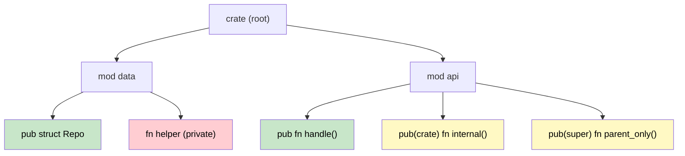

## 模块和 crate：代码组织

> **学习内容：** Rust的模块系统 vs C#命名空间和程序集、`pub`/`pub(crate)`/`pub(super)`可见性、
> 基于文件的模块组织，以及crate如何映射到.NET程序集。
>
> **难度：** 🟢 初级

理解Rust的模块系统对于组织代码和管理依赖至关重要。对于C#开发者，这类似于理解命名空间、程序集和NuGet包。

### Rust 模块 vs C# 命名空间

#### C# 命名空间组织
```csharp
// File: Models/User.cs
namespace MyApp.Models
{
    public class User
    {
        public string Name { get; set; }
        public int Age { get; set; }
    }
}

// File: Services/UserService.cs
using MyApp.Models;

namespace MyApp.Services
{
    public class UserService
    {
        public User CreateUser(string name, int age)
        {
            return new User { Name = name, Age = age };
        }
    }
}

// File: Program.cs
using MyApp.Models;
using MyApp.Services;

namespace MyApp
{
    class Program
    {
        static void Main(string[] args)
        {
            var service = new UserService();
            var user = service.CreateUser("Alice", 30);
        }
    }
}
```

#### Rust 模块组织
```rust
// File: src/models.rs
pub struct User {
    pub name: String,
    pub age: u32,
}

impl User {
    pub fn new(name: String, age: u32) -> User {
        User { name, age }
    }
}

// File: src/services.rs
use crate::models::User;

pub struct UserService;

impl UserService {
    pub fn create_user(name: String, age: u32) -> User {
        User::new(name, age)
    }
}

// File: src/lib.rs (or main.rs)
pub mod models;
pub mod services;

use models::User;
use services::UserService;

fn main() {
    let service = UserService;
    let user = UserService::create_user("Alice".to_string(), 30);
}
```

### 模块层次结构和可见性



> 🟢 Green = public everywhere &nbsp;|&nbsp; 🟡 Yellow = restricted visibility &nbsp;|&nbsp; 🔴 Red = private

#### C# 可见性修饰符
```csharp
namespace MyApp.Data
{
    // public - accessible from anywhere
    public class Repository
    {
        // private - only within this class
        private string connectionString;
        
        // internal - within this assembly
        internal void Connect() { }
        
        // protected - this class and subclasses
        protected virtual void Initialize() { }
        
        // public - accessible from anywhere
        public void Save(object data) { }
    }
}
```

#### Rust 可见性规则
```rust
// Everything is private by default in Rust
mod data {
    struct Repository {  // Private struct
        connection_string: String,  // Private field
    }
    
    impl Repository {
        fn new() -> Repository {  // Private function
            Repository {
                connection_string: "localhost".to_string(),
            }
        }
        
        pub fn connect(&self) {  // Public method
            // Only accessible within this module and its children
        }
        
        pub(crate) fn initialize(&self) {  // Crate-level public
            // Accessible anywhere in this crate
        }
        
        pub(super) fn internal_method(&self) {  // Parent module public
            // Accessible in parent module
        }
    }
    
    // Public struct - accessible from outside the module
    pub struct PublicRepository {
        pub data: String,  // Public field
        private_data: String,  // Private field (no pub)
    }
}

pub use data::PublicRepository;  // Re-export for external use
```

### 模块文件组织

#### C# 项目结构
```text
MyApp/
├── MyApp.csproj
├── Models/
│   ├── User.cs
│   └── Product.cs
├── Services/
│   ├── UserService.cs
│   └── ProductService.cs
├── Controllers/
│   └── ApiController.cs
└── Program.cs
```

#### Rust 模块文件结构
```text
my_app/
├── Cargo.toml
└── src/
    ├── main.rs (or lib.rs)
    ├── models/
    │   ├── mod.rs        // Module declaration
    │   ├── user.rs
    │   └── product.rs
    ├── services/
    │   ├── mod.rs        // Module declaration
    │   ├── user_service.rs
    │   └── product_service.rs
    └── controllers/
        ├── mod.rs
        └── api_controller.rs
```

#### 模块声明模式
```rust
// src/models/mod.rs
pub mod user;      // Declares user.rs as a submodule
pub mod product;   // Declares product.rs as a submodule

// Re-export commonly used types
pub use user::User;
pub use product::Product;

// src/main.rs
mod models;     // Declares models/ as a module
mod services;   // Declares services/ as a module

// Import specific items
use models::{User, Product};
use services::UserService;

// Or import the entire module
use models::user::*;  // Import all public items from user module
```

***

## Crate vs .NET 程序集

### 理解Crate
In Rust, a **crate** is the fundamental unit of compilation and code distribution, similar to how an **assembly** works in .NET.

#### C# 程序集模型
```csharp
// MyLibrary.dll - Compiled assembly
namespace MyLibrary
{
    public class Calculator
    {
        public int Add(int a, int b) => a + b;
    }
}

// MyApp.exe - Executable assembly that references MyLibrary.dll
using MyLibrary;

class Program
{
    static void Main()
    {
        var calc = new Calculator();
        Console.WriteLine(calc.Add(2, 3));
    }
}
```

#### Rust Crate模型
```toml
# Cargo.toml for library crate
[package]
name = "my_calculator"
version = "0.1.0"
edition = "2021"

[lib]
name = "my_calculator"
```

```rust
// src/lib.rs - Library crate
pub struct Calculator;

impl Calculator {
    pub fn add(&self, a: i32, b: i32) -> i32 {
        a + b
    }
}
```

```toml
# Cargo.toml for binary crate that uses the library
[package]
name = "my_app"
version = "0.1.0"
edition = "2021"

[dependencies]
my_calculator = { path = "../my_calculator" }
```

```rust
// src/main.rs - Binary crate
use my_calculator::Calculator;

fn main() {
    let calc = Calculator;
    println!("{}", calc.add(2, 3));
}
```

### Crate类型对比

| C# Concept | Rust Equivalent | Purpose |
|------------|----------------|---------|
| Class Library (.dll) | Library crate | Reusable code |
| Console App (.exe) | Binary crate | Executable program |
| NuGet Package | Published crate | Distribution unit |
| Assembly (.dll/.exe) | Compiled crate | Compilation unit |
| Solution (.sln) | Workspace | Multi-project organization |

### Workspace vs 解决方案

#### C# 解决方案结构
```xml
<!-- MySolution.sln structure -->
<Solution>
    <Project Include="WebApi/WebApi.csproj" />
    <Project Include="Business/Business.csproj" />
    <Project Include="DataAccess/DataAccess.csproj" />
    <Project Include="Tests/Tests.csproj" />
</Solution>
```

#### Rust Workspace结构
```toml
# Cargo.toml at workspace root
[workspace]
members = [
    "web_api",
    "business",
    "data_access",
    "tests"
]

[workspace.dependencies]
serde = "1.0"           # Shared dependency versions
tokio = "1.0"
```

```toml
# web_api/Cargo.toml
[package]
name = "web_api"
version = "0.1.0"
edition = "2021"

[dependencies]
business = { path = "../business" }
serde = { workspace = true }    # Use workspace version
tokio = { workspace = true }
```

---

## 练习

<details>
<summary><strong>🏋️ 练习：设计模块树</strong>（点击展开）</summary>

给定这个C#项目布局，设计等价的Rust模块树：

```csharp
// C#
namespace MyApp.Services { public class AuthService { } }
namespace MyApp.Services { internal class TokenStore { } }
namespace MyApp.Models { public class User { } }
namespace MyApp.Models { public class Session { } }
```

Requirements:
1. `AuthService` and both models must be public
2. `TokenStore` must be private to the `services` module
3. Provide the file layout **and** the `mod` / `pub` declarations in `lib.rs`

<details>
<summary>🔑 Solution</summary>

File layout:
```
src/
├── lib.rs
├── services/
│   ├── mod.rs
│   ├── auth_service.rs
│   └── token_store.rs
└── models/
    ├── mod.rs
    ├── user.rs
    └── session.rs
```

```rust,ignore
// src/lib.rs
pub mod services;
pub mod models;

// src/services/mod.rs
mod token_store;          // private — like C# internal
pub mod auth_service;     // public

// src/services/auth_service.rs
use super::token_store::TokenStore; // visible within the module

pub struct AuthService;

impl AuthService {
    pub fn login(&self) { /* uses TokenStore internally */ }
}

// src/services/token_store.rs
pub(super) struct TokenStore; // visible to parent (services) only

// src/models/mod.rs
pub mod user;
pub mod session;

// src/models/user.rs
pub struct User {
    pub name: String,
}

// src/models/session.rs
pub struct Session {
    pub user_id: u64,
}
```

</details>
</details>

***


