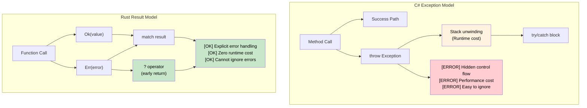

## 异常 vs `Result<T, E>`

> **学习内容：** 为什么Rust用`Result<T, E>`和`Option<T>`替代异常、
> 用于简洁错误传播的`?`操作符，以及显式错误处理如何消除困扰C# `try`/`catch`代码的隐藏控制流。
>
> **难度：** 🟡 中级
>
> **另见**：[Crate级错误类型](ch09-1-crate-level-error-types-and-result-alias.md)了解使用`thiserror`和`anyhow`的生产级错误模式，以及[必要Crate](ch15-1-essential-crates-for-c-developers.md)了解错误crate生态系统。

### C# 基于异常的错误处理
```csharp
// C# - Exception-based error handling
public class UserService
{
    public User GetUser(int userId)
    {
        if (userId <= 0)
        {
            throw new ArgumentException("User ID must be positive");
        }
        
        var user = database.FindUser(userId);
        if (user == null)
        {
            throw new UserNotFoundException($"User {userId} not found");
        }
        
        return user;
    }
    
    public async Task<string> GetUserEmailAsync(int userId)
    {
        try
        {
            var user = GetUser(userId);
            return user.Email ?? throw new InvalidOperationException("User has no email");
        }
        catch (UserNotFoundException ex)
        {
            logger.Warning("User not found: {UserId}", userId);
            return "noreply@company.com";
        }
        catch (Exception ex)
        {
            logger.Error(ex, "Unexpected error getting user email");
            throw; // Re-throw
        }
    }
}
```

### Rust 基于Result的错误处理
```rust
use std::fmt;

#[derive(Debug)]
pub enum UserError {
    InvalidId(i32),
    NotFound(i32),
    NoEmail,
    DatabaseError(String),
}

impl fmt::Display for UserError {
    fn fmt(&self, f: &mut fmt::Formatter<'_>) -> fmt::Result {
        match self {
            UserError::InvalidId(id) => write!(f, "Invalid user ID: {}", id),
            UserError::NotFound(id) => write!(f, "User {} not found", id),
            UserError::NoEmail => write!(f, "User has no email address"),
            UserError::DatabaseError(msg) => write!(f, "Database error: {}", msg),
        }
    }
}

impl std::error::Error for UserError {}

pub struct UserService {
    // database connection, etc.
}

impl UserService {
    pub fn get_user(&self, user_id: i32) -> Result<User, UserError> {
        if user_id <= 0 {
            return Err(UserError::InvalidId(user_id));
        }
        
        // Simulate database lookup
        self.database_find_user(user_id)
            .ok_or(UserError::NotFound(user_id))
    }
    
    pub fn get_user_email(&self, user_id: i32) -> Result<String, UserError> {
        let user = self.get_user(user_id)?; // ? operator propagates errors
        
        user.email
            .ok_or(UserError::NoEmail)
    }
    
    pub fn get_user_email_or_default(&self, user_id: i32) -> String {
        match self.get_user_email(user_id) {
            Ok(email) => email,
            Err(UserError::NotFound(_)) => {
                log::warn!("User not found: {}", user_id);
                "noreply@company.com".to_string()
            }
            Err(err) => {
                log::error!("Error getting user email: {}", err);
                "error@company.com".to_string()
            }
        }
    }
}
```



***

### `?`操作符：简洁地传播错误
```csharp
// C# - Exception propagation (implicit)
public async Task<string> ProcessFileAsync(string path)
{
    var content = await File.ReadAllTextAsync(path);  // Throws on error
    var processed = ProcessContent(content);          // Throws on error
    return processed;
}
```

```rust
// Rust - Error propagation with ?
fn process_file(path: &str) -> Result<String, ConfigError> {
    let content = read_config(path)?;  // ? propagates error if Err
    let processed = process_content(&content)?;  // ? propagates error if Err
    Ok(processed)  // Wrap success value in Ok
}

fn process_content(content: &str) -> Result<String, ConfigError> {
    if content.is_empty() {
        Err(ConfigError::InvalidFormat)
    } else {
        Ok(content.to_uppercase())
    }
}
```

### 用于可空值的`Option<T>`
```csharp
// C# - Nullable reference types
public string? FindUserName(int userId)
{
    var user = database.FindUser(userId);
    return user?.Name;  // Returns null if user not found
}

public void ProcessUser(int userId)
{
    string? name = FindUserName(userId);
    if (name != null)
    {
        Console.WriteLine($"User: {name}");
    }
    else
    {
        Console.WriteLine("User not found");
    }
}
```

```rust
// Rust - Option<T> for optional values
fn find_user_name(user_id: u32) -> Option<String> {
    // Simulate database lookup
    if user_id == 1 {
        Some("Alice".to_string())
    } else {
        None
    }
}

fn process_user(user_id: u32) {
    match find_user_name(user_id) {
        Some(name) => println!("User: {}", name),
        None => println!("User not found"),
    }
    
    // Or use if let (pattern matching shorthand)
    if let Some(name) = find_user_name(user_id) {
        println!("User: {}", name);
    } else {
        println!("User not found");
    }
}
```

### 结合Option和Result
```rust
fn safe_divide(a: f64, b: f64) -> Option<f64> {
    if b != 0.0 {
        Some(a / b)
    } else {
        None
    }
}

fn parse_and_divide(a_str: &str, b_str: &str) -> Result<Option<f64>, ParseFloatError> {
    let a: f64 = a_str.parse()?;  // Return parse error if invalid
    let b: f64 = b_str.parse()?;  // Return parse error if invalid
    Ok(safe_divide(a, b))         // Return Ok(Some(result)) or Ok(None)
}

use std::num::ParseFloatError;

fn main() {
    match parse_and_divide("10.0", "2.0") {
        Ok(Some(result)) => println!("Result: {}", result),
        Ok(None) => println!("Division by zero"),
        Err(error) => println!("Parse error: {}", error),
    }
}
```

***


<details>
<summary><strong>🏋️ 练习：构建Crate级错误类型</strong>（点击展开）</summary>

**挑战**：为文件处理应用程序创建一个`AppError`枚举，可能因I/O错误、JSON解析错误和验证错误而失败。为自动`?`传播实现`From`转换。

```rust
// Starter code
use std::io;

// TODO: Define AppError with variants:
//   Io(io::Error), Json(serde_json::Error), Validation(String)
// TODO: Implement Display and Error traits
// TODO: Implement From<io::Error> and From<serde_json::Error>
// TODO: Define type alias: type Result<T> = std::result::Result<T, AppError>;

fn load_config(path: &str) -> Result<Config> {
    let content = std::fs::read_to_string(path)?;  // io::Error → AppError
    let config: Config = serde_json::from_str(&content)?;  // serde error → AppError
    if config.name.is_empty() {
        return Err(AppError::Validation("name cannot be empty".into()));
    }
    Ok(config)
}
```

<details>
<summary>🔑 Solution</summary>

```rust
use std::io;
use thiserror::Error;

#[derive(Error, Debug)]
pub enum AppError {
    #[error("I/O error: {0}")]
    Io(#[from] io::Error),

    #[error("JSON error: {0}")]
    Json(#[from] serde_json::Error),

    #[error("Validation: {0}")]
    Validation(String),
}

pub type Result<T> = std::result::Result<T, AppError>;

#[derive(serde::Deserialize)]
struct Config {
    name: String,
    port: u16,
}

fn load_config(path: &str) -> Result<Config> {
    let content = std::fs::read_to_string(path)?;
    let config: Config = serde_json::from_str(&content)?;
    if config.name.is_empty() {
        return Err(AppError::Validation("name cannot be empty".into()));
    }
    Ok(config)
}
```

**关键要点**：
- `thiserror`从属性生成`Display`和`Error`实现
- `#[from]`生成`From<T>`实现，启用自动`?`转换
- `Result<T>`别名消除了整个crate中的样板代码
- 与C#异常不同，错误类型在每个函数签名中都是可见的

</details>
</details>


