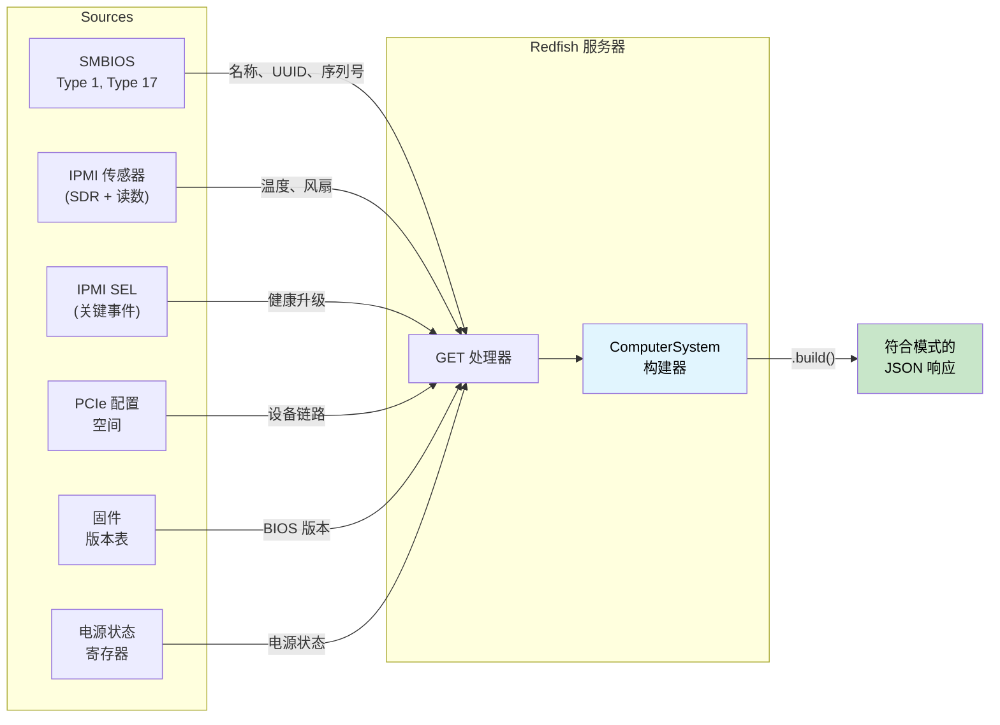

# 应用演练 — 类型安全的 Redfish 服务器 🟡

> **你将学到：** 如何组合响应构建器类型状态、源可用性令牌、量纲序列化、健康汇总、模式版本控制和类型化动作分发，构建一个**无法产生不符合模式的响应**的 Redfish 服务器——这是第17章客户端演练的镜像。
>
> **交叉引用：** [ch02](ch02-typed-command-interfaces-request-determi.md)（类型化命令——反向用于动作分发）、[ch04](ch04-capability-tokens-zero-cost-proof-of-aut.md)（能力令牌——源可用性）、[ch06](ch06-dimensional-analysis-making-the-compiler.md)（量纲类型——序列化端）、[ch07](ch07-validated-boundaries-parse-dont-validate.md)（验证边界——反向："构造，不要序列化"）、[ch09](ch09-phantom-types-for-resource-tracking.md)（幽灵类型——模式版本控制）、[ch11](ch11-fourteen-tricks-from-the-trenches.md)（技巧3——`#[non_exhaustive]`，技巧4——构建器类型状态）、[ch17](ch17-redfish-applied-walkthrough.md)（客户端对应部分）

## 镜像问题

第17章问的是："如何正确消费 Redfish？" 本章问的是镜像问题："如何正确生产 Redfish？"

在客户端，危险是**信任**坏数据。在服务器端，危险是**发出**坏数据——而 fleet 中的每个客户端都信任你发送的内容。

单个 `GET /redfish/v1/Systems/1` 响应必须融合来自多个源的数据：



在 C 中，这是一个500行的处理器，调用六个子系统，用 `json_object_set()` 手动构建 JSON 树，并希望每个必需字段都被填充。忘记一个？响应违反 Redfish 模式。单位搞错？每个客户端看到损坏的遥测数据。

```c
// C — 汇编级问题
json_t *get_computer_system(const char *id) {
    json_t *obj = json_object();
    json_object_set_new(obj, "@odata.type",
        json_string("#ComputerSystem.v1_13_0.ComputerSystem"));

    // 🐛 忘记设置 "Name" — 模式要求它
    // 🐛 忘记设置 "UUID" — 模式要求它

    smbios_type1_t *t1 = smbios_get_type1();
    if (t1) {
        json_object_set_new(obj, "Manufacturer",
            json_string(t1->manufacturer));
    }

    json_object_set_new(obj, "PowerState",
        json_string(get_power_state()));  // 至少这个总是可用的

    // 🐛 读数是原始 ADC 计数值，不是摄氏度 — 没有类型能捕获它
    double cpu_temp = read_sensor(SENSOR_CPU_TEMP);
    // 这个数字最终出现在某处的 Thermal 响应中...
    // 但没有任何东西在类型层面将它与"摄氏度"绑定

    // 🐛 健康状态是手动计算的 — 忘记包含 PSU 状态
    json_object_set_new(obj, "Status",
        build_status("Enabled", "OK")); // 应该是 "Critical" — PSU 正在故障

    return obj; // 缺少2个必需字段，错误健康状态，原始单位
}
```

四个 bug 在一个处理器中。客户端，每个 bug 影响**一个**客户端。服务器端，每个 bug 影响**每个**查询此 BMC 的客户端。

---

## 第1节 — 响应构建器类型状态："构造，不要序列化"（ch07 反向）

第7章教"解析，不要验证"——对入站数据验证一次，在类型中携带证明。服务器端的镜像则是**"构造，不要序列化"**——通过一个构建器构建出站响应，该构建器在所有必需字段都存在时才开启 `.build()`。

```rust,ignore
use std::marker::PhantomData;

// ──── 类型级字段跟踪 ────

pub struct HasField;
pub struct MissingField;

// ──── 响应构建器 ────

/// ComputerSystem Redfish 资源的构建器。
/// 类型参数跟踪哪些必需字段已被提供。
/// 可选字段不需要类型级跟踪。
pub struct ComputerSystemBuilder<Name, Uuid, PowerState, Status> {
    // 必需字段 — 在类型级跟踪
    name: Option<String>,
    uuid: Option<String>,
    power_state: Option<PowerStateValue>,
    status: Option<ResourceStatus>,
    // 可选字段 — 不跟踪（总是可设置）
    manufacturer: Option<String>,
    model: Option<String>,
    serial_number: Option<String>,
    bios_version: Option<String>,
    processor_summary: Option<ProcessorSummary>,
    memory_summary: Option<MemorySummary>,
    _markers: PhantomData<(Name, Uuid, PowerState, Status)>,
}

#[derive(Debug, Clone, serde::Serialize)]
pub enum PowerStateValue { On, Off, PoweringOn, PoweringOff }

#[derive(Debug, Clone, serde::Serialize)]
pub struct ResourceStatus {
    #[serde(rename = "State")]
    pub state: StatusState,
    #[serde(rename = "Health")]
    pub health: HealthValue,
    #[serde(rename = "HealthRollup", skip_serializing_if = "Option::is_none")]
    pub health_rollup: Option<HealthValue>,
}

#[derive(Debug, Clone, Copy, serde::Serialize)]
pub enum StatusState { Enabled, Disabled, Absent, StandbyOffline, Starting }

#[derive(Debug, Clone, Copy, PartialEq, Eq, PartialOrd, Ord, serde::Serialize)]
pub enum HealthValue { OK, Warning, Critical }

#[derive(Debug, Clone, serde::Serialize)]
pub struct ProcessorSummary {
    #[serde(rename = "Count")]
    pub count: u32,
    #[serde(rename = "Status")]
    pub status: ResourceStatus,
}

#[derive(Debug, Clone, serde::Serialize)]
pub struct MemorySummary {
    #[serde(rename = "TotalSystemMemoryGiB")]
    pub total_gib: f64,
    #[serde(rename = "Status")]
    pub status: ResourceStatus,
}

// ──── 构造函数：所有字段从 MissingField 开始 ────

impl ComputerSystemBuilder<MissingField, MissingField, MissingField, MissingField> {
    pub fn new() -> Self {
        ComputerSystemBuilder {
            name: None, uuid: None, power_state: None, status: None,
            manufacturer: None, model: None, serial_number: None,
            bios_version: None, processor_summary: None, memory_summary: None,
            _markers: PhantomData,
        }
    }
}

// ──── 必需字段 setter — 每个转变一个类型参数 ────

impl<U, P, S> ComputerSystemBuilder<MissingField, U, P, S> {
    pub fn name(self, name: String) -> ComputerSystemBuilder<HasField, U, P, S> {
        ComputerSystemBuilder {
            name: Some(name), uuid: self.uuid,
            power_state: self.power_state, status: self.status,
            manufacturer: self.manufacturer, model: self.model,
            serial_number: self.serial_number, bios_version: self.bios_version,
            processor_summary: self.processor_summary,
            memory_summary: self.memory_summary, _markers: PhantomData,
        }
    }
}

impl<N, P, S> ComputerSystemBuilder<N, MissingField, P, S> {
    pub fn uuid(self, uuid: String) -> ComputerSystemBuilder<N, HasField, P, S> {
        ComputerSystemBuilder {
            name: self.name, uuid: Some(uuid),
            power_state: self.power_state, status: self.status,
            manufacturer: self.manufacturer, model: self.model,
            serial_number: self.serial_number, bios_version: self.bios_version,
            processor_summary: self.processor_summary,
            memory_summary: self.memory_summary, _markers: PhantomData,
        }
    }
}

impl<N, U, S> ComputerSystemBuilder<N, U, MissingField, S> {
    pub fn power_state(self, ps: PowerStateValue)
        -> ComputerSystemBuilder<N, U, HasField, S>
    {
        ComputerSystemBuilder {
            name: self.name, uuid: self.uuid,
            power_state: Some(ps), status: self.status,
            manufacturer: self.manufacturer, model: self.model,
            serial_number: self.serial_number, bios_version: self.bios_version,
            processor_summary: self.processor_summary,
            memory_summary: self.memory_summary, _markers: PhantomData,
        }
    }
}

impl<N, U, P> ComputerSystemBuilder<N, U, P, MissingField> {
    pub fn status(self, status: ResourceStatus)
        -> ComputerSystemBuilder<N, U, P, HasField>
    {
        ComputerSystemBuilder {
            name: self.name, uuid: self.uuid,
            power_state: self.power_state, status: Some(status),
            manufacturer: self.manufacturer, model: self.model,
            serial_number: self.serial_number, bios_version: self.bios_version,
            processor_summary: self.processor_summary,
            memory_summary: self.memory_summary, _markers: PhantomData,
        }
    }
}

// ──── 可选字段 setter — 在任何状态下都可用 ────

impl<N, U, P, S> ComputerSystemBuilder<N, U, P, S> {
    pub fn manufacturer(mut self, m: String) -> Self {
        self.manufacturer = Some(m); self
    }
    pub fn model(mut self, m: String) -> Self {
        self.model = Some(m); self
    }
    pub fn serial_number(mut self, s: String) -> Self {
        self.serial_number = Some(s); self
    }
    pub fn bios_version(mut self, v: String) -> Self {
        self.bios_version = Some(v); self
    }
    pub fn processor_summary(mut self, ps: ProcessorSummary) -> Self {
        self.processor_summary = Some(ps); self
    }
    pub fn memory_summary(mut self, ms: MemorySummary) -> Self {
        self.memory_summary = Some(ms); self
    }
}

// ──── .build() 仅在所有必需字段都是 HasField 时存在 ────

impl ComputerSystemBuilder<HasField, HasField, HasField, HasField> {
    pub fn build(self, id: &str) -> serde_json::Value {
        let mut obj = serde_json::json!({
            "@odata.id": format!("/redfish/v1/Systems/{id}"),
            "@odata.type": "#ComputerSystem.v1_13_0.ComputerSystem",
            "Id": id,
            "Name": self.name.unwrap(),
            "UUID": self.uuid.unwrap(),
            "PowerState": self.power_state.unwrap(),
            "Status": self.status.unwrap(),
        });

        // 可选字段 — 仅在存在时包含
        if let Some(m) = self.manufacturer {
            obj["Manufacturer"] = serde_json::json!(m);
        }
        if let Some(m) = self.model {
            obj["Model"] = serde_json::json!(m);
        }
        if let Some(s) = self.serial_number {
            obj["SerialNumber"] = serde_json::json!(s);
        }
        if let Some(v) = self.bios_version {
            obj["BiosVersion"] = serde_json::json!(v);
        }
        if let Some(ps) = self.processor_summary {
            obj["ProcessorSummary"] = serde_json::to_value(ps).unwrap();
        }
        if let Some(ms) = self.memory_summary {
            obj["MemorySummary"] = serde_json::to_value(ms).unwrap();
        }

        obj
    }
}

//
// ── 编译器强制完整性 ──
//
// ✅ 所有必需字段已设置 — .build() 可用:
// ComputerSystemBuilder::new()
//     .name("PowerEdge R750".into())
//     .uuid("4c4c4544-...".into())
//     .power_state(PowerStateValue::On)
//     .status(ResourceStatus { ... })
//     .manufacturer("Dell".into())        // 可选 — 可以包含
//     .build("1")
//
// ❌ 缺少 "Name" — 编译错误:
// ComputerSystemBuilder::new()
//     .uuid("4c4c4544-...".into())
//     .power_state(PowerStateValue::On)
//     .status(ResourceStatus { ... })
//     .build("1")
//   ERROR: method `build` not found for
//   `ComputerSystemBuilder<MissingField, HasField, HasField, HasField>`
```

**消除的 bug 类别：** 不符合模式的响应。处理器在物理上无法在未提供每个必需字段的情况下序列化 `ComputerSystem`。编译器错误信息甚至告诉你**哪个**字段缺失——就在类型参数中：`Name` 位置的 `MissingField`。

---

## 第2节 — 源可用性令牌（能力令牌，ch04 — 新转折）

在 ch04 和 ch17 中，能力令牌证明**授权**——"调用者被允许执行此操作"。在服务器端，相同的模式证明**可用性**——"此数据源已成功初始化"。

BMC 查询的每个子系统都可能独立失败。SMBIOS 表可能损坏。传感器子系统可能仍在初始化。PCIe 总线扫描可能超时。将每个编码为证明令牌：

```rust,ignore
/// SMBIOS 表已成功解析的证明。
/// 仅由 SMBIOS 初始化函数产生。
pub struct SmbiosReady {
    _private: (),
}

/// IPMI 传感器子系统响应的证明。
pub struct SensorsReady {
    _private: (),
}

/// PCIe 总线扫描完成的证明。
pub struct PcieReady {
    _private: (),
}

/// SEL 已成功读取的证明。
pub struct SelReady {
    _private: (),
}

// ──── 数据源初始化 ────

pub struct SmbiosTables {
    pub product_name: String,
    pub manufacturer: String,
    pub serial_number: String,
    pub uuid: String,
}

pub struct SensorCache {
    pub cpu_temp: Celsius,
    pub inlet_temp: Celsius,
    pub fan_readings: Vec<(String, Rpm)>,
    pub psu_power: Vec<(String, Watts)>,
}

/// 丰富的 SEL 汇总 — 通过类型化事件导出的每子系统健康状态。
/// 由 ch07 的使用者管道构建。
/// 用类型化粒度替代有损的 `has_critical_events: bool`。
pub struct TypedSelSummary {
    pub total_entries: u32,
    pub processor_health: HealthValue,
    pub memory_health: HealthValue,
    pub power_health: HealthValue,
    pub thermal_health: HealthValue,
    pub fan_health: HealthValue,
    pub storage_health: HealthValue,
    pub security_health: HealthValue,
}

pub fn init_smbios() -> Option<(SmbiosReady, SmbiosTables)> {
    // 读取 SMBIOS 入口点，解析表...
    // 如果表不存在或损坏则返回 None
    Some((
        SmbiosReady { _private: () },
        SmbiosTables {
            product_name: "PowerEdge R750".into(),
            manufacturer: "Dell Inc.".into(),
            serial_number: "SVC1234567".into(),
            uuid: "4c4c4544-004d-5610-804c-b2c04f435031".into(),
        },
    ))
}

pub fn init_sensors() -> Option<(SensorsReady, SensorCache)> {
    // 初始化 SDR 仓库，读取所有传感器...
    // 如果 IPMI 子系统无响应则返回 None
    Some((
        SensorsReady { _private: () },
        SensorCache {
            cpu_temp: Celsius(68.0),
            inlet_temp: Celsius(24.0),
            fan_readings: vec![
                ("Fan1".into(), Rpm(8400)),
                ("Fan2".into(), Rpm(8200)),
            ],
            psu_power: vec![
                ("PSU1".into(), Watts(285.0)),
                ("PSU2".into(), Watts(290.0)),
            ],
        },
    ))
}

pub fn init_sel() -> Option<(SelReady, TypedSelSummary)> {
    // 生产中：读取 SEL 条目，通过 ch07 的 TryFrom 解析，
    // 通过 classify_event_health() 分类，通过 summarize_sel() 汇总。
    Some((
        SelReady { _private: () },
        TypedSelSummary {
            total_entries: 42,
            processor_health: HealthValue::OK,
            memory_health: HealthValue::OK,
            power_health: HealthValue::OK,
            thermal_health: HealthValue::OK,
            fan_health: HealthValue::OK,
            storage_health: HealthValue::OK,
            security_health: HealthValue::OK,
        },
    ))
}
```

现在，从数据源填充构建器字段的函数**需要相应的证明令牌**：

```rust,ignore
/// 从 SMBIOS 填充字段。需要 SMBIOS 可用的证明。
fn populate_from_smbios<P, S>(
    builder: ComputerSystemBuilder<MissingField, MissingField, P, S>,
    _proof: &SmbiosReady,
    tables: &SmbiosTables,
) -> ComputerSystemBuilder<HasField, HasField, P, S> {
    builder
        .name(tables.product_name.clone())
        .uuid(tables.uuid.clone())
        .manufacturer(tables.manufacturer.clone())
        .serial_number(tables.serial_number.clone())
}

/// SMBIOS 不可用时的回退 — 用安全默认值提供必需字段。
fn populate_smbios_fallback<P, S>(
    builder: ComputerSystemBuilder<MissingField, MissingField, P, S>,
) -> ComputerSystemBuilder<HasField, HasField, P, S> {
    builder
        .name("Unknown System".into())
        .uuid("00000000-0000-0000-0000-000000000000".into())
}
```

处理器根据可用的令牌选择路径：

```rust,ignore
fn build_computer_system(
    smbios: &Option<(SmbiosReady, SmbiosTables)>,
    power_state: PowerStateValue,
    health: ResourceStatus,
) -> serde_json::Value {
    let builder = ComputerSystemBuilder::new()
        .power_state(power_state)
        .status(health);

    let builder = match smbios {
        Some((proof, tables)) => populate_from_smbios(builder, proof, tables),
        None => populate_smbios_fallback(builder),
    };

    // 两条路径都为 Name 和 UUID 产生 HasField。
    // 无论哪种方式 .build() 都可用。
    builder.build("1")
}
```

**消除的 bug 类别：** 调用已失败初始化的子系统。如果 SMBIOS 未解析，你没有 `SmbiosReady` 令牌——编译器强制你走回退路径。没有运行时 `if (smbios != NULL)` 可以忘记。

### 结合源令牌与能力混合（ch08）

有多种 Redfish 资源类型要服务（ComputerSystem、Chassis、Manager、Thermal、Power），源填充逻辑在处理器之间重复。ch08 的**混合**模式消除了这种重复。声明处理器有哪些源，空白 impl 自动提供填充方法：

```rust,ignore
/// ── 数据源的成分 trait（ch08） ──

pub trait HasSmbios {
    fn smbios(&self) -> &(SmbiosReady, SmbiosTables);
}

pub trait HasSensors {
    fn sensors(&self) -> &(SensorsReady, SensorCache);
}

pub trait HasSel {
    fn sel(&self) -> &(SelReady, TypedSelSummary);
}

/// ── 混合：有任何 SMBIOS + 传感器的处理器获得身份填充 ──

pub trait IdentityMixin: HasSmbios {
    fn populate_identity<P, S>(
        &self,
        builder: ComputerSystemBuilder<MissingField, MissingField, P, S>,
    ) -> ComputerSystemBuilder<HasField, HasField, P, S> {
        let (_, tables) = self.smbios();
        builder
            .name(tables.product_name.clone())
            .uuid(tables.uuid.clone())
            .manufacturer(tables.manufacturer.clone())
            .serial_number(tables.serial_number.clone())
    }
}

/// 为有任何 SMBIOS 能力的类型自动实现。
impl<T: HasSmbios> IdentityMixin for T {}

/// ── 混合：有任何传感器 + SEL 的处理器获得健康汇总 ──

pub trait HealthMixin: HasSensors + HasSel {
    fn compute_health(&self) -> ResourceStatus {
        let (_, cache) = self.sensors();
        let (_, sel_summary) = self.sel();
        compute_system_health(
            Some(&(SensorsReady { _private: () }, cache.clone())).as_ref(),
            Some(&(SelReady { _private: () }, sel_summary.clone())).as_ref(),
        )
    }
}

impl<T: HasSensors + HasSel> HealthMixin for T {}

/// ── 具体处理器拥有可用源 ──

struct FullPlatformHandler {
    smbios: (SmbiosReady, SmbiosTables),
    sensors: (SensorsReady, SensorCache),
    sel: (SelReady, TypedSelSummary),
}

impl HasSmbios  for FullPlatformHandler {
    fn smbios(&self) -> &(SmbiosReady, SmbiosTables) { &self.smbios }
}
impl HasSensors for FullPlatformHandler {
    fn sensors(&self) -> &(SensorsReady, SensorCache) { &self.sensors }
}
impl HasSel     for FullPlatformHandler {
    fn sel(&self) -> &(SelReady, TypedSelSummary) { &self.sel }
}

// FullPlatformHandler 自动获得:
//   IdentityMixin::populate_identity()   (通过 HasSmbios)
//   HealthMixin::compute_health()        (通过 HasSensors + HasSel)
//
// 一个仅实现 HasSensors 但没有 HasSel 的 SensorsOnlyHandler
// 会获得 IdentityMixin（如果它有 SMBIOS）但不会获得 HealthMixin。
// 在其上调用 .compute_health() → 编译错误。
```

这直接镜像 ch08 的 `BaseBoardController` 模式：成分 trait 声明你有什么，混合 trait 通过空白 impl 提供行为，编译器在先决条件上限制每个混合。添加新数据源（例如 `HasNvme`）加上混合（例如 `StorageMixin: HasNvme + HasSel`）自动为每个同时拥有两者的处理器提供存储健康汇总。

---

## 第3节 — 序列化边界的量纲类型（ch06）

在客户端（ch17 §4），量纲类型防止**读取**摄氏度为 RPM。在服务器端，它们防止**写入** RPM 到摄氏度 JSON 字段。这可以说更危险——服务器端的错误值会传播到每个客户端。

```rust,ignore
use serde::Serialize;

// ──── ch06 的量纲类型，带 Serialize ────

#[derive(Debug, Clone, Copy, PartialEq, PartialOrd, Serialize)]
pub struct Celsius(pub f64);

#[derive(Debug, Clone, Copy, PartialEq, PartialOrd, Serialize)]
pub struct Rpm(pub u32);

#[derive(Debug, Clone, Copy, PartialEq, PartialOrd, Serialize)]
pub struct Watts(pub f64);

// ──── Redfish Thermal 响应成员 ────
// 字段类型强制哪个单位属于哪个 JSON 属性。

#[derive(Serialize)]
#[serde(rename_all = "PascalCase")]
pub struct TemperatureMember {
    pub member_id: String,
    pub name: String,
    pub reading_celsius: Celsius,           // ← 必须是 Celsius
    #[serde(skip_serializing_if = "Option::is_none")]
    pub upper_threshold_critical: Option<Celsius>,
    #[serde(skip_serializing_if = "Option::is_none")]
    pub upper_threshold_fatal: Option<Celsius>,
    pub status: ResourceStatus,
}

#[derive(Serialize)]
#[serde(rename_all = "PascalCase")]
pub struct FanMember {
    pub member_id: String,
    pub name: String,
    pub reading: Rpm,                       // ← 必须是 Rpm
    pub reading_units: &'static str,        // 总是 "RPM"
    pub status: ResourceStatus,
}

#[derive(Serialize)]
#[serde(rename_all = "PascalCase")]
pub struct PowerControlMember {
    pub member_id: String,
    pub name: String,
    pub power_consumed_watts: Watts,        // ← 必须是 Watts
    #[serde(skip_serializing_if = "Option::is_none")]
    pub power_capacity_watts: Option<Watts>,
    pub status: ResourceStatus,
}

// ──── 从传感器缓存构建 Thermal 响应 ────

fn build_thermal_response(
    _proof: &SensorsReady,
    cache: &SensorCache,
) -> serde_json::Value {
    let temps = vec![
        TemperatureMember {
            member_id: "0".into(),
            name: "CPU Temp".into(),
            reading_celsius: cache.cpu_temp,     // Celsius → Celsius ✅
            upper_threshold_critical: Some(Celsius(95.0)),
            upper_threshold_fatal: Some(Celsius(105.0)),
            status: ResourceStatus {
                state: StatusState::Enabled,
                health: if cache.cpu_temp < Celsius(95.0) {
                    HealthValue::OK
                } else {
                    HealthValue::Critical
                },
                health_rollup: None,
            },
        },
        TemperatureMember {
            member_id: "1".into(),
            name: "Inlet Temp".into(),
            reading_celsius: cache.inlet_temp,   // Celsius → Celsius ✅
            upper_threshold_critical: Some(Celsius(42.0)),
            upper_threshold_fatal: None,
            status: ResourceStatus {
                state: StatusState::Enabled,
                health: HealthValue::OK,
                health_rollup: None,
            },
        },

        // ❌ 编译错误 — 不能把 Rpm 放入 Celsius 字段:
        // TemperatureMember {
        //     reading_celsius: cache.fan_readings[0].1,  // Rpm ≠ Celsius
        //     ...
        // }
    ];

    let fans: Vec<FanMember> = cache.fan_readings.iter().enumerate().map(|(i, (name, rpm))| {
        FanMember {
            member_id: i.to_string(),
            name: name.clone(),
            reading: *rpm,                       // Rpm → Rpm ✅
            reading_units: "RPM",
            status: ResourceStatus {
                state: StatusState::Enabled,
                health: if *rpm > Rpm(1000) { HealthValue::OK } else { HealthValue::Critical },
                health_rollup: None,
            },
        }
    }).collect();

    serde_json::json!({
        "@odata.type": "#Thermal.v1_7_0.Thermal",
        "Temperatures": temps,
        "Fans": fans,
    })
}
```

**消除的 bug 类别：** 序列化时的单位混淆。Redfish 模式规定 `ReadingCelsius` 是摄氏度。Rust 类型系统规定 `reading_celsius` 必须是 `Celsius`。如果开发者意外传入 `Rpm(8400)` 或 `Watts(285.0)`，编译器在值到达 JSON 之前就捕获它。

---

## 第4节 — 作为类型化折叠的健康汇总

Redfish `Status.Health` 是一个*汇总*——所有子组件中最差的健康状态。在 C 中，这通常是一系列 `if` 检查，必然遗漏一个源。有了类型化枚举和 `Ord`，汇总是一行折叠——编译器确保每个源都贡献：

```rust,ignore
/// 从多个源汇总健康状态。
/// HealthValue 上的 Ord: OK < Warning < Critical。
/// 返回最差（最大）值。
fn rollup(sources: &[HealthValue]) -> HealthValue {
    sources.iter().copied().max().unwrap_or(HealthValue::OK)
}

/// 从所有子组件计算系统级健康状态。
/// 获取每个源的显式引用 — 调用者必须提供所有源。
fn compute_system_health(
    sensors: Option<&(SensorsReady, SensorCache)>,
    sel: Option<&(SelReady, TypedSelSummary)>,
) -> ResourceStatus {
    let mut inputs = Vec::new();

    // ── 实时传感器读数 ──
    if let Some((_proof, cache)) = sensors {
        // 温度健康（量纲：摄氏度比较）
        if cache.cpu_temp > Celsius(95.0) {
            inputs.push(HealthValue::Critical);
        } else if cache.cpu_temp > Celsius(85.0) {
            inputs.push(HealthValue::Warning);
        } else {
            inputs.push(HealthValue::OK);
        }

        // 风扇健康（量纲：RPM 比较）
        for (_name, rpm) in &cache.fan_readings {
            if *rpm < Rpm(500) {
                inputs.push(HealthValue::Critical);
            } else if *rpm < Rpm(1000) {
                inputs.push(HealthValue::Warning);
            } else {
                inputs.push(HealthValue::OK);
            }
        }

        // PSU 健康（量纲：瓦特比较）
        for (_name, watts) in &cache.psu_power {
            if *watts > Watts(800.0) {
                inputs.push(HealthValue::Critical);
            } else {
                inputs.push(HealthValue::OK);
            }
        }
    }

    // ── SEL 每子系统健康（来自 ch07 的 TypedSelSummary） ──
    // 每个子系统的健康状态由对每种传感器类型和事件变体的穷尽匹配导出。没有信息丢失。
    if let Some((_proof, sel_summary)) = sel {
        inputs.push(sel_summary.processor_health);
        inputs.push(sel_summary.memory_health);
        inputs.push(sel_summary.power_health);
        inputs.push(sel_summary.thermal_health);
        inputs.push(sel_summary.fan_health);
        inputs.push(sel_summary.storage_health);
        inputs.push(sel_summary.security_health);
    }

    let health = rollup(&inputs);

    ResourceStatus {
        state: StatusState::Enabled,
        health,
        health_rollup: Some(health),
    }
}
```

**消除的 bug 类别：** 不完整的健康汇总。在 C 中，忘记在健康计算中包含 PSU 状态是一个静默 bug——系统在 PSU 故障时报告"OK"。这里，`compute_system_health` 获取每个数据源的显式引用。SEL 贡献不再是 有损的 `bool`——它是七个每子系统 `HealthValue` 字段，通过 ch07 使用者管道中的穷尽匹配导出。添加新 SEL 传感器类型强制分类器处理它；添加新子系统字段强制汇总包含它。

---

## 第5节 — 带幽灵类型的模式版本控制（ch09）

如果 BMC 广告 `ComputerSystem.v1_13_0`，响应**必须**包含该模式版本引入的属性（`LastResetTime`、`BootProgress`）。广告 v1.13 但没有这些字段是 Redfish Interop Validator 失败。幽灵版本标记使这成为编译时契约：

```rust,ignore
use std::marker::PhantomData;

// ──── 模式版本标记 ────

pub struct V1_5;
pub struct V1_13;

// ──── 版本感知响应 ────

pub struct ComputerSystemResponse<V> {
    pub base: ComputerSystemBase,
    _version: PhantomData<V>,
}

pub struct ComputerSystemBase {
    pub id: String,
    pub name: String,
    pub uuid: String,
    pub power_state: PowerStateValue,
    pub status: ResourceStatus,
    pub manufacturer: Option<String>,
    pub serial_number: Option<String>,
    pub bios_version: Option<String>,
}

// 所有版本可用的方法:
impl<V> ComputerSystemResponse<V> {
    pub fn base_json(&self) -> serde_json::Value {
        serde_json::json!({
            "Id": self.base.id,
            "Name": self.base.name,
            "UUID": self.base.uuid,
            "PowerState": self.base.power_state,
            "Status": self.base.status,
        })
    }
}

// ──── v1.13 特定字段 ────

/// 上次系统重置的日期和时间。
pub struct LastResetTime(pub String);

/// 引导进度信息。
pub struct BootProgress {
    pub last_state: String,
    pub last_state_time: String,
}

impl ComputerSystemResponse<V1_13> {
    /// LastResetTime — v1.13+ 必需。
    /// 此方法仅在 V1_13 上存在。如果 BMC 广告 v1.13
    /// 而处理器不调用此方法，该字段将缺失。
    pub fn last_reset_time(&self) -> LastResetTime {
        // 从 RTC 或引导时间戳寄存器读取
        LastResetTime("2026-03-16T08:30:00Z".to_string())
    }

    /// BootProgress — v1.13+ 必需。
    pub fn boot_progress(&self) -> BootProgress {
        BootProgress {
            last_state: "OSRunning".to_string(),
            last_state_time: "2026-03-16T08:32:00Z".to_string(),
        }
    }

    /// 构建完整的 v1.13 JSON 响应，包括版本特定字段。
    pub fn to_json(&self) -> serde_json::Value {
        let mut obj = self.base_json();
        obj["@odata.type"] =
            serde_json::json!("#ComputerSystem.v1_13_0.ComputerSystem");

        let reset_time = self.last_reset_time();
        obj["LastResetTime"] = serde_json::json!(reset_time.0);

        let boot = self.boot_progress();
        obj["BootProgress"] = serde_json::json!({
            "LastState": boot.last_state,
            "LastStateTime": boot.last_state_time,
        });

        obj
    }
}

impl ComputerSystemResponse<V1_5> {
    /// v1.5 JSON — 无 LastResetTime，无 BootProgress。
    pub fn to_json(&self) -> serde_json::Value {
        let mut obj = self.base_json();
        obj["@odata.type"] =
            serde_json::json!("#ComputerSystem.v1_5_0.ComputerSystem");
        obj
    }

    // last_reset_time() 在此处不存在。
    // 调用它 → 编译错误:
    //   let resp: ComputerSystemResponse<V1_5> = ...;
    //   resp.last_reset_time();
    //   ❌ ERROR: method `last_reset_time` not found for
    //            `ComputerSystemResponse<V1_5>`
}
```

**消除的 bug 类别：** 模式版本不匹配。如果 BMC 配置为广告 v1.13，使用 `ComputerSystemResponse<V1_13>`，编译器确保每个 v1.13 必需字段都被产生。降级到 v1.5？更改类型参数——v1.13 方法消失，没有死字段泄露到响应中。

---

## 第6节 — 类型化动作分发（ch02 反向）

在 ch02 中，类型化命令模式在**客户端**绑定 `Request → Response`。在**服务器端**，相同模式验证入站动作有效负载并类型安全地分发——反方向。

```rust,ignore
use serde::Deserialize;

// ──── 动作 trait（ch02 IpmiCmd trait 的镜像） ────

/// Redfish 动作：框架从 POST body 反序列化为 Params，
/// 然后调用 execute()。如果 JSON 与 Params 不匹配，反序列化
/// 失败 — execute() 从不以坏输入调用。
pub trait RedfishAction {
    /// 预期的 JSON body 结构。
    type Params: serde::de::DeserializeOwned;
    /// 执行动作的结果。
    type Result: serde::Serialize;

    fn execute(&self, params: Self::Params) -> Result<Self::Result, RedfishError>;
}

#[derive(Debug)]
pub enum RedfishError {
    InvalidPayload(String),
    ActionFailed(String),
}

// ──── ComputerSystem.Reset ────

pub struct ComputerSystemReset;

#[derive(Debug, Deserialize)]
pub enum ResetType {
    On,
    ForceOff,
    GracefulShutdown,
    GracefulRestart,
    ForceRestart,
    ForceOn,
    PushPowerButton,
}

#[derive(Debug, Deserialize)]
#[serde(rename_all = "PascalCase")]
pub struct ResetParams {
    pub reset_type: ResetType,
}

impl RedfishAction for ComputerSystemReset {
    type Params = ResetParams;
    type Result = ();

    fn execute(&self, params: ResetParams) -> Result<(), RedfishError> {
        match params.reset_type {
            ResetType::GracefulShutdown => {
                // 发送 ACPI 关机到主机
                println!("Initiating ACPI shutdown");
                Ok(())
            }
            ResetType::ForceOff => {
                // 强制关闭主机电源
                println!("Forcing power off");
                Ok(())
            }
            ResetType::On | ResetType::ForceOn => {
                println!("Powering on");
                Ok(())
            }
            ResetType::GracefulRestart => {
                println!("ACPI restart");
                Ok(())
            }
            ResetType::ForceRestart => {
                println!("Forced restart");
                Ok(())
            }
            ResetType::PushPowerButton => {
                println!("Simulating power button press");
                Ok(())
            }
            // 穷尽 — 编译器捕获缺失变体
        }
    }
}

// ──── Manager.ResetToDefaults ────

pub struct ManagerResetToDefaults;

#[derive(Debug, Deserialize)]
pub enum ResetToDefaultsType {
    ResetAll,
    PreserveNetworkAndUsers,
    PreserveNetwork,
}

#[derive(Debug, Deserialize)]
#[serde(rename_all = "PascalCase")]
pub struct ResetToDefaultsParams {
    pub reset_to_defaults_type: ResetToDefaultsType,
}

impl RedfishAction for ManagerResetToDefaults {
    type Params = ResetToDefaultsParams;
    type Result = ();

    fn execute(&self, params: ResetToDefaultsParams) -> Result<(), RedfishError> {
        match params.reset_to_defaults_type {
            ResetToDefaultsType::ResetAll => {
                println!("Full factory reset");
                Ok(())
            }
            ResetToDefaultsType::PreserveNetworkAndUsers => {
                println!("Reset preserving network + users");
                Ok(())
            }
            ResetToDefaultsType::PreserveNetwork => {
                println!("Reset preserving network config");
                Ok(())
            }
        }
    }
}

// ──── 通用动作分发器 ────

fn dispatch_action<A: RedfishAction>(
    action: &A,
    raw_body: &str,
) -> Result<A::Result, RedfishError> {
    // 反序列化验证有效负载结构。
    // 如果 JSON 与 A::Params 不匹配，这失败
    // 而 execute() 从不被调用。
    let params: A::Params = serde_json::from_str(raw_body)
        .map_err(|e| RedfishError::InvalidPayload(e.to_string()))?;

    action.execute(params)
}

// ── 用法 ──

fn handle_reset_action(body: &str) -> Result<(), RedfishError> {
    // 类型安全：ResetParams 由 serde 在 execute() 之前验证
    dispatch_action(&ComputerSystemReset, body)?;
    Ok(())

    // 无效 JSON: {"ResetType": "Explode"}
    // → serde 错误: "unknown variant `Explode`"
    // → execute() 从不被调用

    // 缺失字段: {}
    // → serde 错误: "missing field `ResetType`"
    // → execute() 从不被调用
}
```

**消除的 bug 类别：**
- **无效动作有效负载：** serde 在调用 `execute()` 之前拒绝未知枚举变体和缺失字段
  。没有手动的 `if (body["ResetType"] == ...)` 链。
- **缺失变体处理：** `match params.reset_type` 是穷尽的 — 添加新 `ResetType` 变体强制每个动作处理器更新。
- **类型混淆：** `ComputerSystemReset` 期望 `ResetParams`；
  `ManagerResetToDefaults` 期望 `ResetToDefaultsParams`。trait 系统防止将一个动作的参数传递给另一个动作的处理器。

---

## 第7节 — 整合一切：GET 处理器

以下是组合所有六节到一个符合模式的响应的完整处理器：

```rust,ignore
/// 完整的 GET /redfish/v1/Systems/1 处理器。
///
/// 每个必需字段由构建器类型状态强制。
/// 每个数据源由可用性令牌限制。
/// 每个单位锁定在其量纲类型。
/// 每个健康输入馈入类型化汇总。
fn handle_get_computer_system(
    smbios: &Option<(SmbiosReady, SmbiosTables)>,
    sensors: &Option<(SensorsReady, SensorCache)>,
    sel: &Option<(SelReady, TypedSelSummary)>,
    power_state: PowerStateValue,
    bios_version: Option<String>,
) -> serde_json::Value {
    // ── 1. 健康汇总（第4节） ──
    // 将传感器 + SEL 的健康折叠为单个类型化状态
    let health = compute_system_health(
        sensors.as_ref(),
        sel.as_ref(),
    );

    // ── 2. 构建器类型状态（第1节） ──
    let builder = ComputerSystemBuilder::new()
        .power_state(power_state)
        .status(health);

    // ── 3. 源可用性令牌（第2节） ──
    let builder = match smbios {
        Some((proof, tables)) => {
            // SMBIOS 可用 — 从硬件填充
            populate_from_smbios(builder, proof, tables)
        }
        None => {
            // SMBIOS 不可用 — 安全默认值
            populate_smbios_fallback(builder)
        }
    };

    // ── 4. 从传感器可选丰富（第3节） ──
    let builder = if let Some((_proof, cache)) = sensors {
        builder
            .processor_summary(ProcessorSummary {
                count: 2,
                status: ResourceStatus {
                    state: StatusState::Enabled,
                    health: if cache.cpu_temp < Celsius(95.0) {
                        HealthValue::OK
                    } else {
                        HealthValue::Critical
                    },
                    health_rollup: None,
                },
            })
    } else {
        builder
    };

    let builder = match bios_version {
        Some(v) => builder.bios_version(v),
        None => builder,
    };

    // ── 5. 构建（第1节） ──
    // .build() 可用，因为两条路径（SMBIOS 存在/不存在）
    // 都为 Name 和 UUID 产生 HasField。编译器验证了这一点。
    builder.build("1")
}

// ──── 服务器启动 ────

fn main() {
    // 初始化所有数据源 — 每个返回一个可用性令牌
    let smbios = init_smbios();
    let sensors = init_sensors();
    let sel = init_sel();

    // 模拟处理器调用
    let response = handle_get_computer_system(
        &smbios,
        &sensors,
        &sel,
        PowerStateValue::On,
        Some("2.10.1".into()),
    );

    println!("{}", serde_json::to_string_pretty(&response).unwrap());
}
```

**预期输出：**

```json
{
  "@odata.id": "/redfish/v1/Systems/1",
  "@odata.type": "#ComputerSystem.v1_13_0.ComputerSystem",
  "Id": "1",
  "Name": "PowerEdge R750",
  "UUID": "4c4c4544-004d-5610-804c-b2c04f435031",
  "PowerState": "On",
  "Status": {
    "State": "Enabled",
    "Health": "OK",
    "HealthRollup": "OK"
  },
  "Manufacturer": "Dell Inc.",
  "SerialNumber": "SVC1234567",
  "BiosVersion": "2.10.1",
  "ProcessorSummary": {
    "Count": 2,
    "Status": {
      "State": "Enabled",
      "Health": "OK"
    }
  }
}
```

### 编译器证明的内容（服务器端）

| # | bug 类别 | 如何防止 | 模式（节） |
|---|-----------|-------------------|-------------------|
| 1 | 响应中缺少必需字段 | `.build()` 要求所有类型状态标记为 `HasField` | 构建器类型状态（§1） |
| 2 | 调用已失败的子系统 | 源可用性令牌限制数据访问 | 能力令牌（§2） |
| 3 | 不可用源没有回退 | 两条 `match` 分支（存在/不存在）都必须产生 `HasField` | 类型状态 + 穷尽匹配（§2） |
| 4 | JSON 字段中单位错误 | `reading_celsius: Celsius` ≠ `Rpm` ≠ `Watts` | 量纲类型（§3） |
| 5 | 健康汇总不完整 | `compute_system_health` 获取显式源引用；SEL 通过 ch07 的 `TypedSelSummary` 提供每子系统 `HealthValue` | 类型化函数签名 + 穷尽匹配（§4） |
| 6 | 模式版本不匹配 | `ComputerSystemResponse<V1_13>` 有 `last_reset_time()`；`V1_5` 没有 | 幽灵类型（§5） |
| 7 | 接受无效动作有效负载 | serde 在调用 `execute()` 之前拒绝未知/缺失字段 | 类型化动作分发（§6） |
| 8 | 缺失动作变体处理 | `match params.reset_type` 是穷尽的 | 枚举穷尽性（§6） |
| 9 | 错误动作的错误参数 | `RedfishAction::Params` 是关联类型 | 类型化命令反向（§6） |

**总运行时开销：零。** 构建器标记、可用性令牌、幽灵版本类型和量纲 newtype 都编译掉。产生的 JSON 与手工编写的 C 版本相同——减去九类 bug。

---

## 镜像：客户端与服务器模式映射

| 关注点 | 客户端（ch17） | 服务器（本章） |
|---------|---------------|--------------------|
| **边界方向** | 入站：JSON → 类型化值 | 出站：类型化值 → JSON |
| **核心原则** | "解析，不要验证" | "构造，不要序列化" |
| **字段完整性** | `TryFrom` 验证必需字段存在 | 构建器类型状态在必需字段上限制 `.build()` |
| **单位安全** | 读取时 `Celsius` ≠ `Rpm` | 写入时 `Celsius` ≠ `Rpm` |
| **权限/可用性** | 能力令牌限制请求 | 可用性令牌限制数据源访问 |
| **数据源** | 单个源（BMC） | 多源（SMBIOS、传感器、SEL、PCIe、...） |
| **模式版本** | 幽灵类型防止访问不支持的字段 | 幽灵类型强制提供版本必需字段 |
| **动作** | 客户端发送类型化动作 POST | 服务器通过 `RedfishAction` trait 验证和分发 |
| **健康** | 读取并信任 `Status.Health` | 通过类型化汇总计算 `Status.Health` |
| **故障传播** | 一个坏解析 → 一个客户端错误 | 一个坏序列化 → 每个客户端看到错误数据 |

这两章形成一个完整的故事。第17章："我消费的每个响应都是类型检查的。" 本章："我产生的每个响应都是类型检查的。" 相同的模式双向流动——类型系统不知道或不在乎你在线的哪一端。

## 关键要点

1. **"构造，不要序列化"** 是"解析，不要验证"的服务器端镜像——使用构建器类型状态使 `.build()` 仅在所有必需字段存在时才可用。
2. **源可用性令牌证明初始化**——ch04 的相同能力令牌模式，重新用于证明数据源已就绪。
3. **量纲类型保护生产者和消费者**——将 `Rpm` 放入 `ReadingCelsius` 字段是编译错误，不是客户报告的 bug。
4. **健康汇总是类型化折叠**——`HealthValue` 上的 `Ord` 加上显式源引用意味着编译器捕获"忘记包含 PSU 状态"。
5. **类型级的模式版本控制**——幽灵类型参数使版本特定字段在编译时出现和消失。
6. **动作分发反转 ch02**——`serde` 将有效负载反序列化为类型化 `Params` 结构，枚举变体上的穷尽匹配意味着添加新 `ResetType` 强制每个处理器更新。
7. **服务器端 bug 传播到每个客户端**——这就是为什么生产者端的编译时正确性比消费者端更关键。
